<p align="center"></p>

# FamQuest

[English](README.md) · **Deutsch**

Self-hosted, zweisprachige (Deutsch/Englisch) Familien-App für ein Touchscreen-Display am Kühlschrank:
**Routinen → Aufgaben → Erledigung → Punkte → Belohnungen.**

Eine Installation gehört genau einer Familie. Alles läuft lokal in Docker, ohne Cloud-Dienste und
ohne externe CDNs. Die vollständige Spezifikation steht in [`docs/SPEC.md`](docs/SPEC.md).

> **Status:** Version 1.1. Enthält das Aufgabensystem (Routinen, Familienansicht, Punkte,
> Belohnungen, Kontrolle durch die Eltern), den Google Kalender (nur lesend), die Startseite „Heute“
> als Wochen-Dashboard mit Wetter, den Bilderrahmen mit Nachtmodus, den Essensplan, die
> Einkaufsliste und den Haushalt (Putzplan mit Ampel, „Zu erledigen“). Der Feinschliff läuft im
> Alltag weiter (siehe [Roadmap](#roadmap)).

**Ausprobieren ohne Installation:** [demo-de.kaufmann.city](https://demo-de.kaufmann.city/) –
„Demo öffnen“ antippen, die Eltern-PIN steht auf der Anmeldeseite. Die Beispielfamilie setzt sich
zur vollen Stunde zurück. (Auf Englisch: [demo-en.kaufmann.city](https://demo-en.kaufmann.city/).)

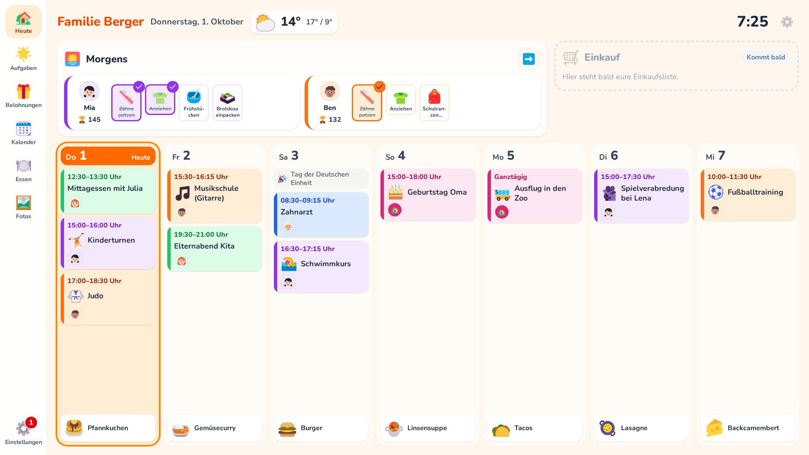

| Aufgaben der Woche | Termindetails | Symbole für Termine | Am Handy |
| --- | --- | --- | --- |
| 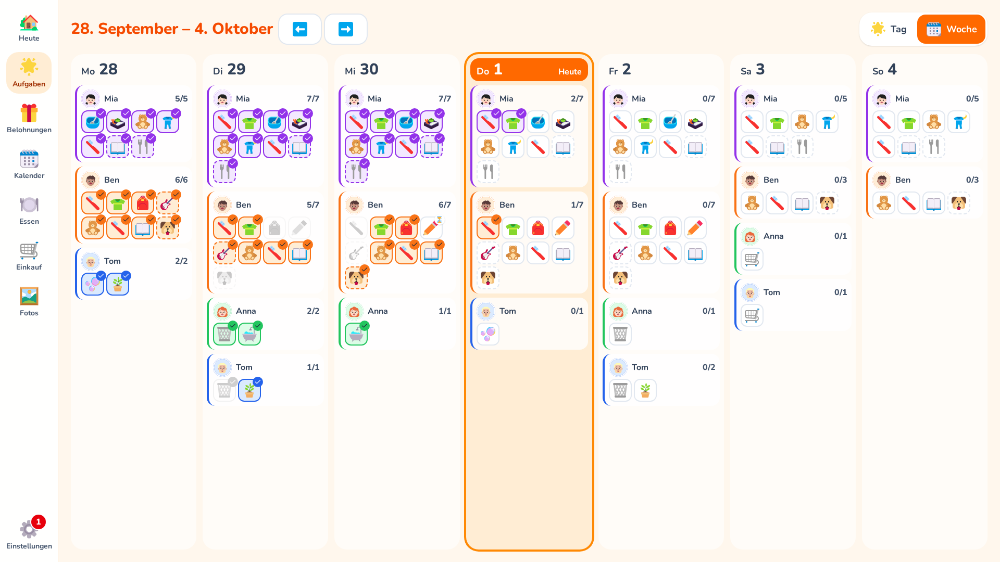 | 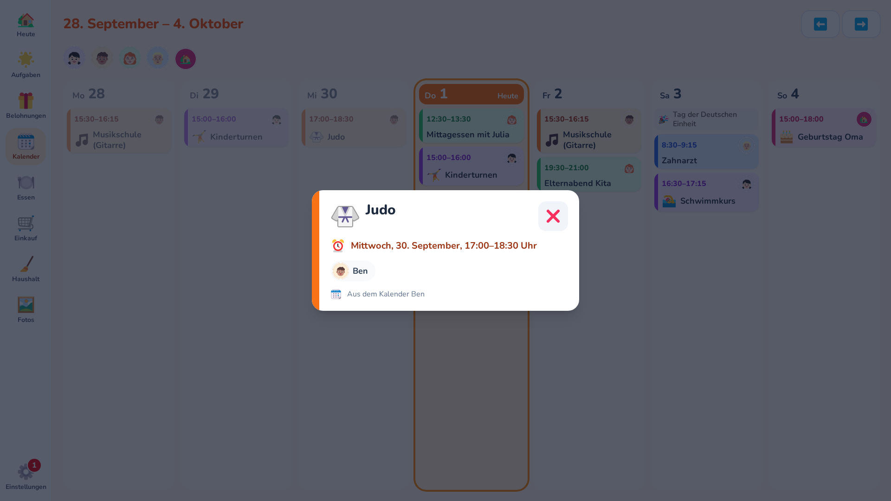 | 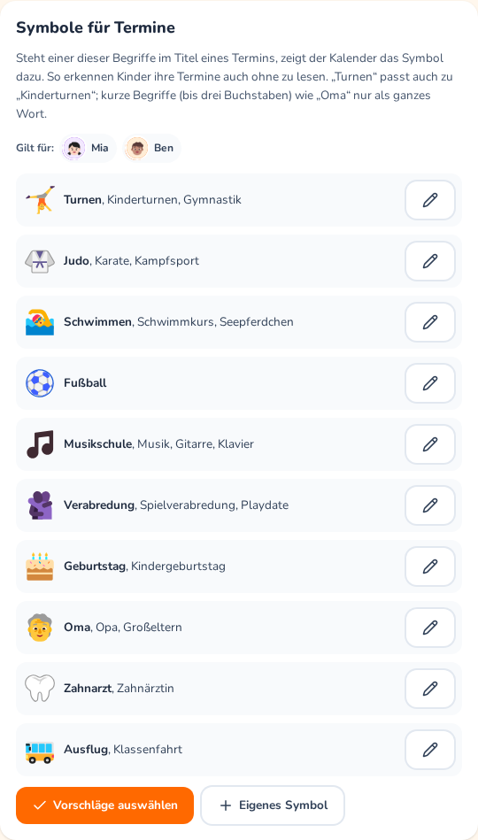 | 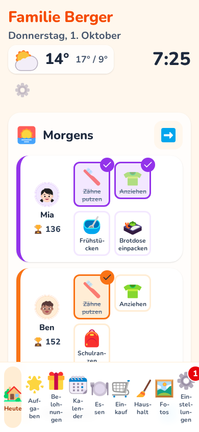 |

Die Screenshots zeigen eine Beispielfamilie (Demodaten, siehe [Entwicklung](#entwicklung)).

## Features

- Startseite „Heute“ als Wochen-Dashboard: Uhr und Wetter, die aktuelle Routine der Kinder und die
  nächsten sieben Tage mit Terminen und Essen
- Aufgaben mit einer Spalte je Kind, daneben der Haushalt; ein Tipp erledigt
- Routinen (täglich, bestimmte Wochentage, Mo–Fr, einmalig, flexibel „etwa alle X Tage“) und
  Tagesabschnitte
- Routinen in fester Reihenfolge je Person, freiwillige Extra-Aufgaben im eigenen Block
- „Einer für alle“: von einem Kind erledigt, für alle erledigt (z. B. Tisch decken)
- Punkte als Buchungen, Tagesfortschritt, manuelle Gutschriften
- Belohnungen je Kind aus einer Vorschlagsliste, am Display einlösen
- Kontrolle durch die Eltern für ausgewählte Aufgaben
- Faire Verteilung: wer wie viel im Haushalt erledigt hat
- Google Kalender (nur lesend): Wochenansicht am Display, Termine in der Farbe der Person, Symbole
  für Termine der Kinder (z. B. Judo, Reiten, Verabredung), damit sie sie ohne Lesen erkennen
- Wetter für euren Ort (Open-Meteo, ohne API-Schlüssel)
- Bilderrahmen: hochgeladene Fotos im Vollbild mit Überblendung, per Symbol oder nach Leerlauf,
  auf Wunsch mit Uhr, Wetter, nächstem Termin und offenen Aufgaben, dazu ein Nachtmodus (schwarz
  oder gedimmte Uhr)
- Essensplan: Gerichte für die Woche direkt am Display eintippen, mit Vorschlägen und Symbolen
- Einkaufsliste: am Display oder Handy eintragen, was fehlt (Vorschläge mit Symbolen, Menge oder
  Hinweis), im Laden abhaken
- Haushalt: Putzplan mit Ampel statt Terminen (jede Hausarbeit mit eigenem Abstand, je Raum), ein
  Einrichtungs-Assistent schlägt Räume, Aufgaben und Abstände passend zu eurem Zuhause vor; was
  dran ist, steht auch auf „Heute“ und neben den Kindern unter „Aufgaben“. Dazu „Zu erledigen“:
  eine gemeinsame Liste für Einmaliges wie „Hühnerfutter holen“
- Küchenansicht für ein kleines Tablet: Termine und Essen der nächsten Tage, per Wisch Aufgaben,
  Haushalt und Einkauf
- Elternbereich mit Eltern-PIN
- Profilbilder mit Zuschnitt, eine Farbe pro Person
- Deutsch und Englisch, weitere Sprachen über Übersetzungsdateien

## Schnellstart auf einem Docker-Host

Auf dem Host braucht ihr nur Git und Docker mit dem Compose-Plugin. Das Image baut Frontend und
Backend selbst (Multi-Stage-Build), Node.js oder Python sind nicht nötig.

```sh
git clone https://github.com/craebby/FamQuest.git
cd FamQuest
cp .env.example .env
# Zufälliges Datenbank-Passwort erzeugen und in .env eintragen
sed -i "s|^POSTGRES_PASSWORD=.*|POSTGRES_PASSWORD=$(openssl rand -hex 24)|" .env
docker compose up -d --build
```

Der erste Build dauert ein paar Minuten. Danach ist die App unter `http://<host>:8080` erreichbar
(Port über `APP_PORT` in `.env` einstellbar). Beim Start des App-Containers laufen die
Datenbank-Migrationen automatisch. Hebt die `.env` gut auf: Sie enthält das Datenbank-Passwort und
wird für ein Restore gebraucht.

Status prüfen:

```sh
docker compose ps                        # beide Dienste sollten "healthy" sein
curl http://localhost:8080/api/health    # {"status":"ok","database":"ok"}
```

Aktualisieren:

```sh
git pull
docker compose up -d --build
```

`main` hat immer den neuesten Stand. Für eine feste Version stattdessen ein
[Release](https://github.com/craebby/FamQuest/releases) auschecken, z. B. `git fetch --tags && git checkout v1.1.1`,
danach `docker compose up -d --build`.

Unter macOS `sed -i ''` statt `sed -i` verwenden oder die `.env` einfach von Hand bearbeiten.

## Erster Start

Beim ersten Aufruf erscheint die Einrichtung: Sprache, Familienname, E-Mail, Passwort (zweimal)
und die Eltern-PIN. Das erste Konto wird Administrator. Danach ist die Einrichtung dauerhaft gesperrt;
weitere Konten lassen sich nicht über die Oberfläche registrieren.

- Das Display bleibt dauerhaft angemeldet (die Anmeldung verlängert sich bei Nutzung, bis zu einem
  Jahr ohne Nutzung).
- Der Elternbereich (Zahnrad) ist zusätzlich durch die Eltern-PIN geschützt. Nach 2 Minuten ohne
  Eingabe kehrt das Display zur Startseite zurück und sperrt ihn wieder.
- Der Elternbereich hat ein Menü mit acht Bereichen: **Prüfen & Punkte** (mit roter Zahl, wenn
  etwas wartet), **Familie**, **Aufgaben**, **Routinen**, **Belohnungen**, **Fotos**, **Kalender &
  Wetter** und
  **Einstellungen** (Familie, PIN, Gerät, Konto). Am Tablet und am Display steht das Menü links, am
  Handy stehen die vier wichtigsten Bereiche unten, der Rest unter **Mehr**. Jeder Bereich hat eine
  eigene Adresse (z. B. `/parents/routines`), beim Neuladen bleibt man also, wo man war.
- Die PIN lässt sich im Elternbereich ändern oder abschalten. PIN vergessen: Mit dem Passwort des
  Kontos eine neue PIN festlegen.
- Nach 5 falschen Versuchen (Passwort oder PIN) sind weitere Versuche 15 Minuten lang gesperrt.
- Familienname, Sprache der Familie und Zeitzone lassen sich im Elternbereich unter
  „Einstellungen“ ändern. Die Zeitzone bestimmt, wann ein neuer Tag beginnt (Standard: Europe/Berlin).

## Familienmitglieder

Im Elternbereich unter „Familie“ legt ihr alle Personen des Haushalts an: Name, Rolle
(Elternteil oder Kind), Farbe und optional ein Foto. Kinder brauchen kein Konto und kein Passwort.

- Jede Person hat eine eigene Farbe (Orange, Blau, Lila, Grün, Rot, Türkis, Gelb). Vergebene
  Farben sind ausgegraut; es sind daher höchstens sieben Personen möglich.
- **Reihenfolge ändern** legt fest, in welcher Reihenfolge die Personen überall erscheinen
  (Spalten, Filter, Belohnungen): mit Pfeiltasten oder per Ziehen mit der Maus.
- Foto wählen (am Smartphone auch direkt mit der Kamera), im Kreis verschieben und zoomen,
  übernehmen. Ohne Foto zeigt der Avatar die Initiale auf der Personenfarbe.
- Das Bild wird im Browser zugeschnitten und vom Server geprüft (nur JPEG, PNG oder WebP, höchstens
  5 MB), auf 512 × 512 px verkleinert und als WebP neu gespeichert. Metadaten wie GPS-Daten gehen
  dabei verloren. Die Bilder liegen im Volume `uploads` und sind nur mit Anmeldung abrufbar.

## Aufgaben und Routinen

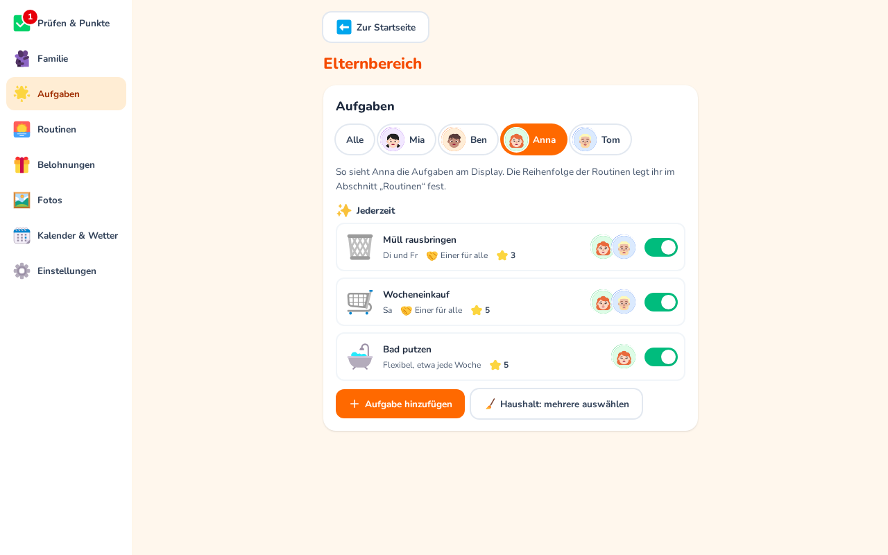

Im Elternbereich unter „Aufgaben“ legt ihr fest, wer was wann erledigt. Eine Aufgabe hat:

- **Symbol**: aus einem mitgelieferten Katalog von gut 200 farbigen Emoji-Symbolen
  ([Fluent Emoji](https://github.com/microsoft/fluentui-emoji), MIT-Lizenz), sortiert nach
  Kategorien wie Körperpflege, Anziehen, Schule oder Haushalt. Die Suche versteht Deutsch und
  Englisch („Zahn“ und „tooth“ finden dieselbe Zahnbürste). Solange ihr kein Symbol selbst wählt,
  schlägt die App eins passend zum Titel vor.
- **Titel** und optional eine Beschreibung
- **Punkte**: 0 bis 1000
- **Für wen**: ein oder mehrere Kinder; jedes erledigt die Aufgabe und bekommt die Punkte für
  sich. Mit **„Einer für alle“** (ab zwei Kindern) gilt sie dagegen für alle als erledigt, sobald
  ein Kind sie erledigt hat, etwa „Tisch decken“ bei Geschwistern. Die anderen Spalten zeigen den
  Avatar des Kindes, das es war; die Punkte bekommt dieses Kind. Erwachsene bekommen keine
  Aufgaben: Ihre Hausarbeit steht im Putzplan (siehe [Haushalt](#haushalt)).
- **Wie oft**: jeden Tag, an bestimmten Wochentagen (mit Schnellauswahl Mo–Fr oder Wochenende),
  einmal an einem Datum oder **flexibel** (siehe unten)
- **Wann**: morgens, mittags, nachmittags, abends, jederzeit oder **Extra**. Die Aufgaben eines
  Tagesabschnitts bilden eine **Routine** in fester Reihenfolge (z. B. morgens: Zähne putzen →
  anziehen → Kuscheltier einpacken); für Kinder stellt ihr sie unter [Routinen](#routinen)
  zusammen. **Extras** sind freiwillig (z. B. Tisch abräumen): Sie stehen
  in einem eigenen Block am Ende, bringen Punkte, zählen aber nicht zum Tagesfortschritt
- **Farbe der Karte**: standardmäßig die Farbe der jeweiligen Person
- **Aktiv**: inaktive Aufgaben bleiben gespeichert, erscheinen aber nicht in der Familienansicht
- **Eltern prüfen**: Punkte gibt es erst, wenn ihr die Erledigung bestätigt habt (siehe
  [Kontrolle durch die Eltern](#kontrolle-durch-die-eltern))

Beim Anlegen füllt **„Aus Vorlagen wählen“** das Formular mit einem Tipp vor: kurze
Alltagsroutinen der Kinder (morgens Zähne putzen, Anziehen, Frühstücken; nach Kita oder Schule
Rucksack aufhängen, Brotdose ausräumen; abends Spielsachen aufräumen, Schlafanzug, Zähne putzen, ab
ins Bett) plus freiwillige Extras (Tisch decken, beim Kochen helfen …). Alles bleibt danach
änderbar. Die Vorlagen stehen in `frontend/src/pools/tasks.ts`, ihre Titel in
`frontend/src/locales/<sprache>/pool.json`. Vorlagen für Hausarbeit bringt der
Einrichtungs-Assistent im Bereich [Haushalt](#haushalt) mit.

Die Belohnungs-Vorschläge (`frontend/src/pools/rewards.ts`) enthalten nur, was es nicht ohnehin
gibt, z. B. einen besonderen Frühstückswunsch, Bildschirmzeit, einen Film aussuchen, eine besondere
Aktivität, Geld für die Spardose, etwas aus dem Spielzeugladen. Die Preise gehen von etwa 15–20
Punkten am Tag aus; große Belohnungen (Übernachtungsparty, Ausflug, Freizeitpark, großer Wunsch)
sind zum Sparen über mehrere Wochen gedacht.

**Flexible Aufgaben** haben keinen festen Tag, sondern einen Rhythmus: alle X Tage (Schnellwahl
alle 2 Tage, jede Woche, alle 2 Wochen, jeden Monat) und ein Datum für die erste Fälligkeit. Ab dann
steht die Aufgabe in der Familienansicht, bis sie erledigt ist; ist sie überfällig, zeigt die Karte
einen roten Hinweis mit Wecker („seit 3 Tagen fällig“). Danach ist sie X Tage nach der Erledigung
wieder dran. Vorher steht sie klein unter **„Demnächst“** und kann schon früher erledigt werden,
der Rhythmus beginnt dann ab diesem Tag neu. „Demnächst“ zählt nicht zum Tagesfortschritt.

Die Liste lässt sich mit einem Tipp auf eine Person filtern. Neue Aufgaben sind dann für diese
Person vorausgewählt. Gefiltert auf eine Person zeigt die Liste deren Aufgaben in Blöcken genau wie am
Display. Der Schalter in jeder Zeile setzt eine Aufgabe aktiv oder inaktiv. Wird eine
Person gelöscht, bleiben ihre Aufgaben erhalten; Aufgaben ohne Person sind in der Liste markiert.

Die Symbole sind beim Build ins Frontend eingebettet (nur die Katalog-Symbole, nicht das ganze Set).
Katalog erweitern: Namen aus dem Set `fluent-emoji-flat` (z. B. auf
[icon-sets.iconify.design](https://icon-sets.iconify.design/fluent-emoji-flat/)) in
`frontend/src/icons/categories.json` eintragen und in `frontend/src/locales/<sprache>/icons.json`
Suchbegriffe ergänzen (der erste Begriff ist die Bezeichnung). Symbole, die es im Set nicht gibt
(z. B. einen Schlafanzug), setzt `frontend/src/icons/composed.json` aus Symbolen des Sets zusammen.
Tests prüfen, dass jedes Symbol existiert und in jeder Sprache eindeutig benannt ist.

### Routinen

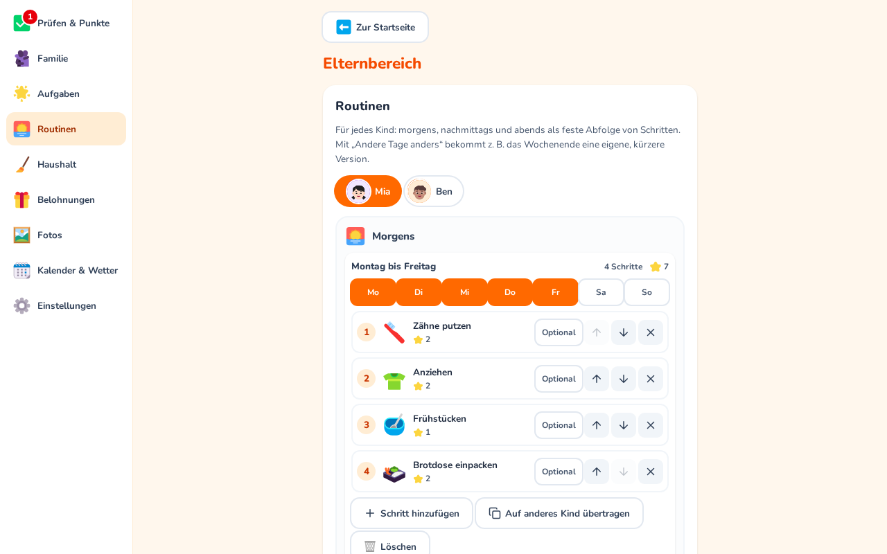

Im Abschnitt **„Routinen“** des Elternbereichs stellt ihr die Routinen jedes Kindes zusammen: eine
feste Abfolge von Schritten für **morgens**, **nachmittags** und **abends** (**mittags**, sobald es
dort eine Routine gibt). Oben ein Kind antippen; das gewählte Kind ist immer hervorgehoben.

- **Versionen für verschiedene Tage:** Jede Routine hat ihre Wochentage (Mo … So antippen). Mit
  **„Andere Tage anders“** bekommt ein Tagesabschnitt eine weitere Version, z. B. einen kürzeren
  Morgen am Wochenende; sie startet als Kopie der Schritte, ihr nehmt nur heraus, was nicht nötig
  ist. Ein Tag gehört immer zu genau einer Version; Tage ohne Routine stehen darunter.
- **Schritte** sind nummeriert in der Reihenfolge, in der das Kind sie am Display sieht, dazu die
  Anzahl der Schritte und die Sterne. **↑/↓** ändert die Reihenfolge, **✕** nimmt einen Schritt aus
  der Routine (die Aufgabe selbst bleibt), ein Tipp öffnet den Aufgaben-Editor.
- **Optionale Schritte** (z. B. „Kuscheltier einpacken“) bleiben in der Routine und bringen Punkte,
  zählen aber nicht zum Tagesfortschritt; am Display haben sie einen gestrichelten Rand.
- **„Schritt hinzufügen“** legt einen neuen Schritt an (der Editor fragt nur nach Symbol, Titel,
  Punkten usw.; Kind, Tagesabschnitt und Tage bestimmt die Routine) oder übernimmt einen
  vorhandenen, z. B. „Zähne putzen“ aus der Werktags-Version.
- **„Auf anderes Kind übertragen“** kopiert eine Version auf ein Geschwisterkind (gleiche Schritte;
  jedes Kind erledigt und punktet getrennt). An diesen Tagen ersetzt sie dessen bisherige Routine.

Ist eine Aufgabe für ein Kind Schritt einer Routine, steht sie für dieses Kind genau an den Tagen
der Routine an; ihr eigenes „Wie oft?“ gilt nur noch für andere Kinder mit derselben Aufgabe. Extras, „Jederzeit“ sowie einmalige und flexible Aufgaben gehören zu keiner
Routine; sie bleiben im Abschnitt „Aufgaben“. Beim Update werden bestehende Aufgaben der Kinder
automatisch zu Routinen: Wochentage mit denselben Schritten werden eine Version, die Reihenfolge
bleibt.

## Heute (Startseite)

Die Startseite ist ein Wochen-Dashboard fürs Wanddisplay (auf schmalen Bildschirmen untereinander):

- **Kopf:** Familienname, Datum, das **Wetter** klein (Symbol, Temperatur jetzt, heute Höchst-/
  Tiefstwert, ab 50 % Regenwahrscheinlichkeit ein Schirm) und eine große Uhr. Den Ort legen die
  Eltern im Elternbereich unter **Kalender & Wetter** fest (Name oder Postleitzahl suchen, dann aus
  der Liste wählen); ohne Ort steht dort „Wetter einrichten“.
- **Routine der Kinder:** nur die Kinder, nur der aktuelle Tagesabschnitt (morgens, mittags,
  nachmittags, abends) mit seinen Aufgaben als Symbole. **Ein Tipp** erledigt eine Aufgabe wie in
  der Familienansicht (mit „+2“, Sanduhr bei Kontrolle durch die Eltern); nochmal tippen macht es
  rückgängig. Ist alles geschafft oder gerade keine Routine dran, steht beim Kind nur **„Alles
  erledigt“**. Der Avatar öffnet die Personenansicht, der Pfeil die Aufgaben.
- **Haushalt** daneben: was im Putzplan **rot oder gelb** ist, das Dringendste zuerst (höchstens
  sechs, der Rest als „+3 weitere“). **Ein Tipp** erledigt, danach fragt die Leiste „Wer war's?“
  wie in der Ansicht Haushalt; Erledigtes bleibt bis zum Tagesende durchgestrichen stehen, ein
  weiterer Tipp nimmt es zurück. Ist nichts dran, steht dort „Alles im grünen Bereich“. Der Pfeil
  öffnet den ganzen Putzplan (siehe [Haushalt](#haushalt)).
- **Einkauf** daneben: was fehlt, als Symbole mit Namen (und Menge oder Hinweis). „Eintragen“
  öffnet denselben Dialog wie die Einkaufsliste (siehe [Einkaufsliste](#einkaufsliste)), der Pfeil
  die Liste.
- **Die nächsten sieben Tage** ab heute über die ganze Breite: je Tag Feiertage oder Ferien, die
  Termine in der Personenfarbe (ein Tipp öffnet die Details) und **unten das Essen** mit Foto oder
  Symbol und Namen, z. B. „Ofengemüse mit Würstchen“. Ein Tipp aufs Essen oder aufs **+** trägt
  direkt ein (siehe [Essensplan](#essensplan)). Ohne Kalender steht dort „Kalender verbinden“,
  das Essen erscheint trotzdem. Am Wanddisplay passt die Seite genau auf den Bildschirm: Das Essen
  bleibt immer unten sichtbar, an vollen Tagen scrollen nur die Termine dieses Tages (ein
  Ausblenden und ein kleiner Pfeil zeigen, dass es weitergeht). Ganztägige Termine brauchen nur eine
  Zeile, heute schon vorbei gegangene Termine schrumpfen auf Uhrzeit und Titel.

**Startseite anpassen:** Das Zahnrad auf „Heute“ fragt die Eltern-PIN ab und zeigt dann die
Bereiche Wetter, Routine der Kinder, Einkauf, Termine und Essen. Jeder lässt sich ein- und
ausschalten, die Anordnung ist fest. Darunter wählt ihr, wie die Woche läuft: **Ab heute** (heute
steht immer vorne, dann die nächsten sechs Tage) oder **Montag bis Sonntag** wie ein Wochenplan,
vergangene Tage bleiben blass sichtbar. „Standard wiederherstellen“ schaltet alles wieder ein und
die Woche auf „Ab heute“. Die
Einstellung wird auf dem Server gespeichert und gilt für alle Displays der Familie. Die Wochen-
übersicht der Aufgaben (Ringe je Person) gibt es im Aufgabenbereich unter „Woche“.

## Küchenansicht

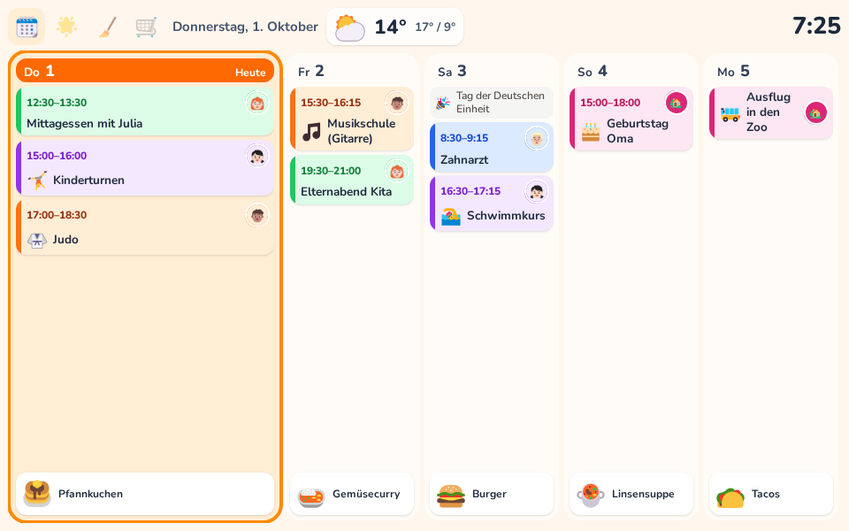

Für ein kleines Tablet in der Küche (gedacht für 8 Zoll im Querformat) gibt es eine abgespeckte
Ansicht unter der Adresse **`/kitchen`**, z. B. `http://famquest.local:8080/kitchen`. Sie hat keine
Navigationsleiste; legt die Adresse am Tablet als Startseite fest. Im Elternbereich führt unter
**Einstellungen → Dieses Gerät** der Knopf „Küchenansicht öffnen“ dorthin.

- **Erste Seite:** heute (doppelt so breit) und die nächsten vier Tage, je Tag oben die Termine und
  unten das Essen. Ein Tipp aufs Essen trägt ein oder ändert es, ein Tipp auf einen Termin zeigt die
  Details.
- **Wischen:** nach links folgen die aktuelle Routine der Kinder zum Abhaken, der **Haushalt**
  („Zu erledigen“ und Putzplan) und die **Einkaufsliste**. Die vier Symbole oben links springen
  direkt zur Seite und zeigen, wo ihr seid.
- **Kopfzeile:** Datum, Wetter und Uhr.
- Nach zwei Minuten ohne Berührung steht wieder die erste Seite da.
- **Nachtmodus:** Es gilt das Nachtfenster des [Bilderrahmens](#fotos-bilderrahmen) (schwarz oder
  gedimmte Uhr). Ein Tipp weckt die Ansicht; nach zwei Minuten Ruhe wird es wieder dunkel. Fotos
  zeigt die Küchenansicht nicht.
- Läuft die Anmeldung ab, führt das Anmelden zurück in die Küchenansicht.

## Familienansicht

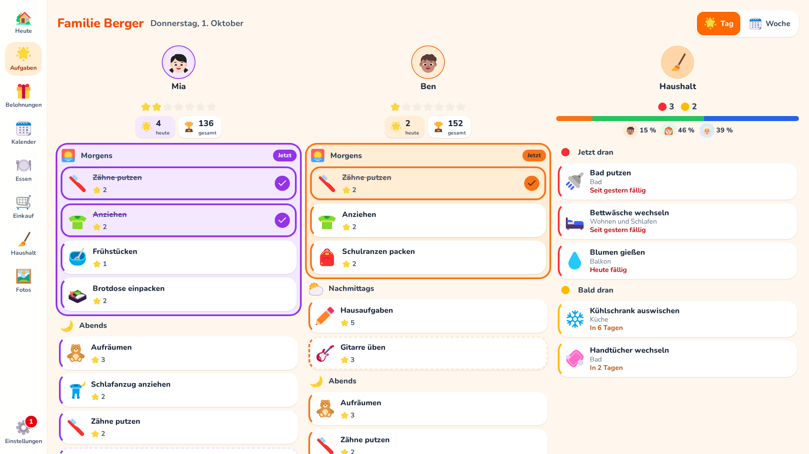

Die Familienansicht („Aufgaben“, Stern) zeigt die Kinder nebeneinander, jedes mit großem Avatar und
seinen heutigen Aufgaben. Niemand muss sich an- oder ummelden: Wem eine Aufgabe gehört, ergibt sich
aus der Spalte. Erwachsene haben keine eigene Spalte; rechts daneben steht die Spalte **Haushalt**
(Besen) mit dem, was im Putzplan gerade rot oder gelb ist (siehe [Haushalt](#haushalt)). Sie
erscheint, sobald es einen Putzplan gibt.

- **Ein Tipp** auf eine Aufgabenkarte erledigt sie für diese Person (Haken, Einfärbung in der
  Personenfarbe). **Nochmal tippen** macht es rückgängig. Jede Aufgabe kann pro Person und Tag nur
  einmal erledigt sein, auch bei Doppel-Tipps.
- Die Aufgaben sind nach **Tageszeit** als Routinen in der von den Eltern festgelegten Reihenfolge
  gruppiert (Sonnenaufgang, Sonne, Sonne mit Wolke, Mond; dazu „Jederzeit“), danach folgen die
  freiwilligen **Extras** (Bizeps). Der aktuelle Abschnitt ist farbig hervorgehoben. Ist ein Abschnitt komplett
  erledigt, klappt er zu einer Zeile mit Haken zusammen und lässt sich mit einem Tipp wieder öffnen.
  Tageszeiten: morgens bis 11 Uhr, mittags bis 14 Uhr, nachmittags bis 18 Uhr, danach abends.
- Ein Tipp auf den **Avatar** öffnet die Personenansicht mit denselben Aufgaben in groß. Nach einer
  Minute ohne Eingabe kehrt das Display zur Startseite zurück.
- Bei vielen Personen oder schmalem Bildschirm lassen sich die Spalten seitlich wischen. Am
  Smartphone steht eine Person pro Seite, oben eine Avatar-Leiste zum Wechseln.
- Die **Navigationsleiste** (links, am Smartphone unten) führt mit Symbolen zu „Heute“ (Haus), zu
  den Aufgaben (Stern, die Familienansicht), zu den Belohnungen (Geschenk), zum Kalender und zu den
  Einstellungen (Zahnrad, Elternbereich mit PIN). Eine rote
  Zahl am Zahnrad zeigt, wie viele Erledigungen auf die Kontrolle der Eltern warten.

**Tag | Woche:** Der Umschalter oben rechts in der Familienansicht öffnet die **Wochenansicht**
(Montag bis Sonntag, blättern mit den Pfeilen wie im Kalender). Sie zeigt je Tag und Person die
Aufgaben als kleine Symbole in der Reihenfolge der Routine: erledigt in der Personenfarbe mit Haken,
wartet auf Kontrolle mit Sanduhr, kommt noch in Weiß, an vergangenen Tagen nicht erledigt blass,
„Einer für alle“ von jemand anderem erledigt in Grau. Neben jeder Person steht, wie viele
Routine-Aufgaben erledigt sind (Extras zählen nicht mit). Die Woche ist nur zum Anschauen; erledigt
wird heute, in der Tagesansicht oder auf der Startseite. Vergangene Tage zeigen die Aufgaben so, wie
sie jetzt eingerichtet sind (ab ihrem Anlegetag), dazu alles, was tatsächlich erledigt wurde.

Die Oberfläche skaliert ab Tablet-Breite mit der Fensterhöhe: volle Größe bei 1080 px
(Wanddisplay), proportional kleiner auf Laptops mit Skalierung (z. B. 14"-Bildschirm), nie unter
75 %. Am Smartphone bleibt sie in voller Größe. Im Elternbereich unter „Dieses Gerät“ lässt sich
zusätzlich eine **Anzeigegröße** (klein, normal, groß) wählen, die nur auf diesem Gerät gilt, z. B.
kleiner am Tablet und größer am Wanddisplay. Dort steht auch, was der Browser meldet
(Fenstergröße, Skalierung, Grundschrift). Das hilft beim Einrichten eines neuen Displays.

„Heute“ rechnet der Server immer in der Zeitzone der Familie. Die Ansicht lädt sich jede Minute neu,
damit Tageswechsel und Änderungen aus dem Elternbereich ankommen.

## Punkte

Unter jedem Avatar zeigt eine **Sterne-Reihe** den Tagesfortschritt (ein Stern pro Aufgabe, erledigte
leuchten; ab 9 Aufgaben ein Balken). Daneben stehen die **heute verdienten Punkte** (Stern) und der
**Punktestand** (Pokal). Beim Abhaken schwebt kurz „+2 ⭐“ über der Karte. Wer in den
Systemeinstellungen reduzierte Bewegung eingestellt hat, sieht die Anzeige ohne Animation.

Punkte werden nie als Zähler gespeichert, sondern als **Buchungen**; der Punktestand ist ihre Summe.

- Erledigen bucht den Punktwert der Aufgabe, Rückgängig bucht genau diesen Betrag zurück
  (Gegenbuchung), auch wenn der Punktwert inzwischen geändert wurde.
- Pro Aufgabe, Person und Tag gibt es höchstens eine Erledigung (Datenbank-Constraint). Nur die
  Anfrage, die sie tatsächlich anlegt oder löscht, bucht; Doppel-Tipps bringen also keine doppelten
  Punkte.
- Buchungen werden nie geändert oder gelöscht. Wird eine Aufgabe gelöscht, bleiben ihre Buchungen
  mit dem damaligen Titel erhalten. Nur wenn eine Person gelöscht wird, verschwinden auch ihre
  Buchungen.
- Aufgaben mit 0 Punkten erzeugen keine Buchung.

Im Elternbereich zeigt der Abschnitt **„Punkte“** den Stand jeder Person. Ein Tipp auf die Person
öffnet ihre **Buchungshistorie** (neueste zuerst, ältere per „Ältere Buchungen laden“) und ein
Formular, um Punkte mit Begründung **gutzuschreiben oder abzuziehen** (1 bis 1000). Ein Abzug darf
den Punktestand nicht unter 0 drücken.

Erwachsene sammeln keine Punkte und haben keine eigenen Aufgaben; ihre Hausarbeit steht im
Putzplan (siehe [Haushalt](#haushalt) und [Faire Verteilung](#faire-verteilung)).

## Kontrolle durch die Eltern

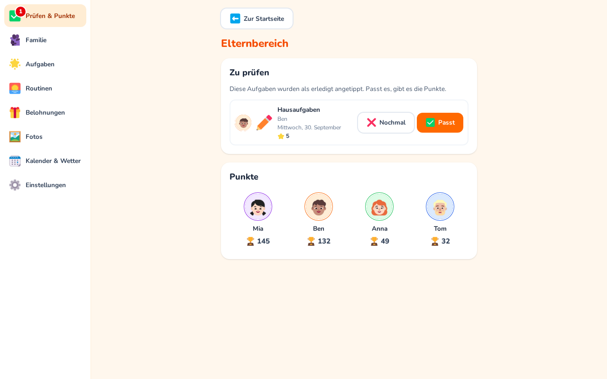

Für Aufgaben wie „Zimmer aufräumen“ lässt sich im Editor **„Eltern prüfen“** einschalten. Das Kind
tippt die Karte wie gewohnt an; statt des Hakens erscheint eine **Sanduhr**, und es gibt noch keine
Punkte. Am Zahnrad der Navigationsleiste steht, wie viele Erledigungen warten.

Im Elternbereich (nach PIN) steht dann ganz oben **„Zu prüfen“**:

- **Passt** bestätigt die Erledigung und bucht die Punkte, genau einmal und für den Tag der
  Erledigung. Mehrere Einträge lassen sich mit „Alle bestätigen“ auf einmal bestätigen.
- **Nochmal** lehnt ab: Die Erledigung wird entfernt, die Aufgabe ist wieder offen.

Auch Erledigungen früherer Tage bleiben prüfbar. Macht das Kind die Erledigung vor der Kontrolle
selbst rückgängig, wird nichts gebucht.

## Belohnungen

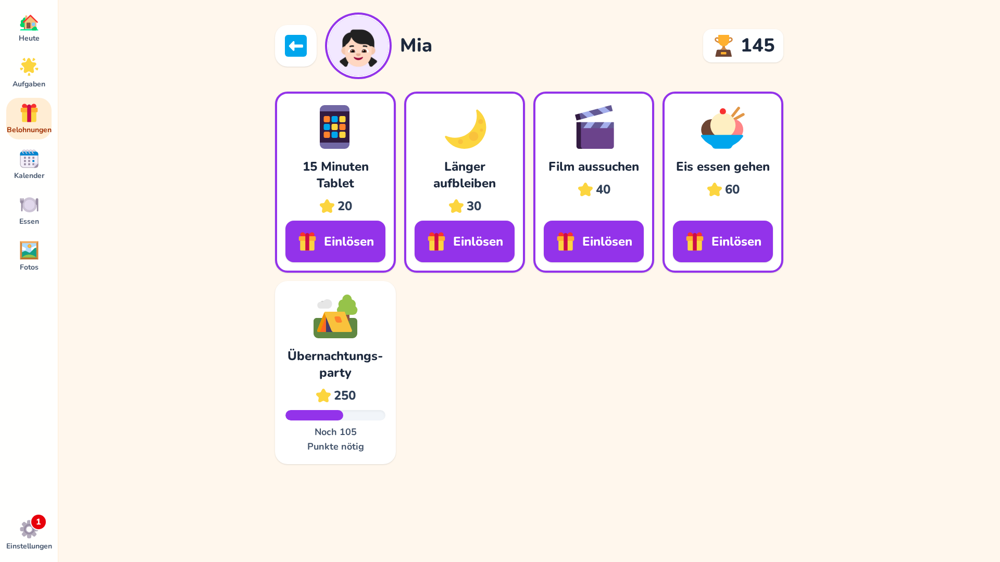

Belohnungen gibt es **nur für Kinder**, und jedes Kind hat seine eigenen. So passen Auswahl und
Kosten zum Alter. Im Elternbereich unter „Belohnungen“ wählt ihr ein Kind und dann:

- **Aus Vorschlägen wählen**: eine Liste mit gut 30 Belohnungen in drei Größen (klein etwa 5–20,
  mittel 20–50, groß 50–100 Punkte), z. B. Eis, eine Geschichte mehr, 15 Minuten länger
  aufbleiben, Filmabend mit Popcorn, Zoo oder Freizeitpark. Mehrere lassen sich auf einmal
  übernehmen, schon vorhandene sind markiert.
- **Eigene Belohnung**: Name, Symbol (Kategorie „Belohnungen“ im Katalog), Kosten (1 bis 1000),
  Beschreibung.

Kosten und Namen lassen sich danach ändern. Inaktive Belohnungen sind am Display nicht zu sehen.
Darunter steht, was das Kind zuletzt eingelöst hat.

Am Display führt das **Geschenk** in der Navigationsleiste zur Auswahl der Kinder, ein Tipp auf den
Avatar zu ihren Belohnungskarten (die Personenansicht eines Kindes zeigt sie ebenfalls):

- Mit genug Punkten zeigt die Karte **„Einlösen“**, sonst **„Noch 8 Punkte nötig“** mit einem Balken.
- Nach „Einlösen“ fragt eine große Karte mit ✓ und ✗ nach. Bestätigt, bucht der Server die Kosten ab.
  Er prüft Punktestand und Kosten dabei in einer Transaktion, der Stand kann nie negativ werden.
  Danach gibt es eine kurze Feier.

Die Einlösung speichert Name, Symbol und Kosten. Die Historie stimmt also auch, wenn die Belohnung
später geändert oder gelöscht wird. Die Vorschläge stehen in `frontend/src/pools/rewards.ts`.

## Faire Verteilung

Erwachsene bekommen keine Punkte und keine Belohnungen. Stattdessen zeigt FamQuest, wie sich die
Hausarbeit verteilt: **„Wer hat's gemacht?“** zählt die Erledigungen im Putzplan und in
„Zu erledigen“ der letzten 30 Tage, zu denen jemand bei „Wer war's?“ einen Avatar angetippt hat,
und zeigt die Anteile (z. B. 40 % und 60 %) als geteilten Balken in den Personenfarben. Er steht
unten in der Ansicht **Haushalt** (mit Namen und Anzahl) und kompakt über der Haushalt-Spalte unter
**Aufgaben**.

Erwachsene stehen immer dabei, Kinder nur, wenn sie mitgeholfen haben. Gezählt wird die Anzahl,
nicht der Aufwand; Erledigungen ohne Angabe zählen für niemanden. Das ist bewusst kein Wettbewerb,
sondern soll helfen, die Arbeit fair zu verteilen. Solange niemand etwas angetippt hat oder nur
eine Person dabei wäre, entfällt die Anzeige.

## Google Kalender

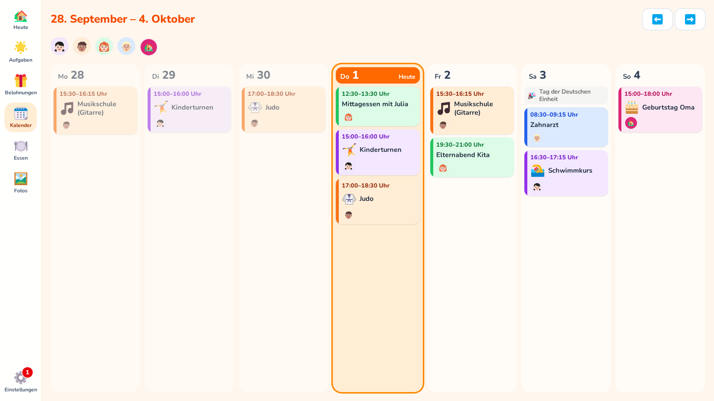

FamQuest zeigt eure Google-Kalender als Woche am Display: eine Spalte pro Tag (Montag bis
Sonntag), Termine in der Farbe der Person, der sie gehören, mit ihrem Avatar. FamQuest liest die
Kalender nur und ändert nichts daran.

**Im Elternbereich unter Kalender:**

- Ein oder mehrere Google-Konten verbinden (Einrichtung siehe unten).
- Alle Kalender des Kontos erscheinen in einer Liste. Die, die am Display zu sehen sein sollen,
  einschalten.
- Je Kalender wählen, wem er **gehört**: einer Person oder der **Familie** (für alles, was alle
  betrifft, z. B. ein gemeinsamer Familienkalender, Müllabfuhr oder Feiertage).
- **Farbe der Familie**: „Familie“ bekommt eine eigene Farbe und ein Haus als Avatar. Rosa und Grau
  sind für die Familie reserviert; Farben, die schon eine Person hat, sind ausgegraut.
- Jeder Kalender zeigt, wann er zuletzt aktualisiert wurde oder was schiefging. **Jetzt
  aktualisieren** holt sofort den neuesten Stand.

**Am Display:** Sobald mindestens ein Kalender eingeschaltet ist, zeigt die Navigationsleiste ein
Kalender-Symbol. Mit den Pfeilen blättert man wochenweise; heute ist hervorgehoben, vergangene
Termine werden blasser. Ein Tipp auf einen Avatar oben zeigt nur die Termine dieser Person (und die
der Familie), ein zweiter Tipp wieder alle. Steht derselbe Termin in mehreren Kalendern (z. B. eine
Einladung an beide Eltern), erscheint er einmal mit allen Avataren. Kann ein Kalender nicht
aktualisiert werden, erscheint über der Woche ein Hinweis; die zuletzt bekannten Termine bleiben
sichtbar. Ganztägige Termine sehen aus wie alle anderen, nur mit „Ganztägig“ statt einer Uhrzeit.
Ein Tipp auf einen Termin zeigt die Details: Datum und Uhrzeit, Personen, Ort, Beschreibung und die
Kalender, aus denen er stammt. Bearbeitet werden Termine im Google Kalender; FamQuest zeigt sie nur
an.

**Feiertage und Ferien:** Ist die Familiensprache Deutsch, gibt es im Elternbereich unter
**Kalender** die Einstellung **Bundesland** mit zwei Schaltern, **Feiertage** und **Schulferien**.
Sie erscheinen dezent in Grau über den Terminen des Tages (🎉 Feiertag, 🏖️ Ferien) und
funktionieren auch ohne Google-Konto. Feiertage werden offline berechnet, Schulferien einmal am Tag
von [OpenHolidays](https://www.openholidaysapi.org) geladen (übertragen wird nur das Bundesland,
keine persönlichen Daten).

**Symbole für Termine:** Kinder, die noch nicht lesen, erkennen ihre Termine nicht am Titel. Unter
**Kalender & Wetter → Symbole für Termine** legt ihr fest, welche Begriffe ein Symbol bekommen:
aus rund 20 Vorschlägen ankreuzen (Turnen, Judo, Reiten, Schwimmen, Fußball, Musikschule,
Verabredung, Geburtstag, Oma & Opa, Kita, Arzt, Zahnarzt …) oder eigene Einträge mit einem Symbol
und mehreren Begriffen anlegen („Verabredung, bei Lena“). Ein Begriff passt auch als Wortteil
(„Turnen“ in „Kinderturnen“); Begriffe bis drei Buchstaben nur als ganzes Wort, damit „Opa“ nicht
in „Europa“ steckt. Passen mehrere, gewinnt der längste („Zahnarzt“ vor „Arzt“). Ob die Termine
einer Person Symbole bekommen, ist ein Schalter bei der Person (**Symbole bei Terminen**):
standardmäßig an bei Kindern, aus bei Erwachsenen; für ältere Kinder einfach ausschalten. Das
Symbol erscheint im Kalender, auf „Heute“, in den Termindetails und im Bilderrahmen.

## Wetter

Die Startseite zeigt das Wetter für einen Ort. Die Vorhersage kommt von
[Open-Meteo](https://open-meteo.com) (für nicht kommerzielle Nutzung kostenlos, ohne API-Schlüssel).
Die Anfrage stellt der Server, nicht der Browser; übertragen werden nur die Koordinaten des Orts und
die Zeitzone. Vorhersagen werden 15 Minuten zwischengespeichert; ist Open-Meteo nicht erreichbar,
bleibt die letzte Vorhersage bis zu 6 Stunden mit Hinweis stehen. Auch die Ortssuche im
Elternbereich läuft über den Server (Open-Meteo Geocoding). Ohne Ort stellt FamQuest keine
Wetter-Anfragen.

**Synchronisation:** Alle 5 Minuten (`CALENDAR_SYNC_MINUTES`) fragt FamQuest bei Google nach, ob
sich etwas geändert hat (inkrementell per Sync-Token). Nur dann, beim Wochenwechsel oder zur
Sicherheit alle 6 Stunden werden die Termine neu geladen, und zwar für einen Zeitraum von 4 Wochen
vor der aktuellen Woche bis etwa ein halbes Jahr voraus. Serientermine werden als einzelne Termine
gespeichert; ganztägige und mehrtägige Termine werden unterstützt. Ist Google nicht erreichbar oder
bremst die Abrufe, versucht es der nächste Durchlauf einfach wieder.

Weil FamQuest selbst gehostet ist, braucht jede Installation einen eigenen Zugang bei Google.
Das ist einmalig und kostenlos. Voraussetzung ist, dass FamQuest per **HTTPS unter einer Domain**
erreichbar ist (z. B. `https://familie.example.com` über einen Reverse Proxy). Google erlaubt keine
Weiterleitung an eine IP-Adresse oder an `http://`, nur an `http://localhost` zum Entwickeln.

1. In der [Google Cloud Console](https://console.cloud.google.com/) ein neues Projekt anlegen,
   z. B. „FamQuest“.
2. Unter **APIs & Dienste → Bibliothek** die **Google Calendar API** aktivieren.
3. Unter **Google Auth Platform** die App einrichten: Name (z. B. FamQuest) und Support-E-Mail,
   Zielgruppe **Extern**. Unter **Datenzugriff** den Bereich
   `https://www.googleapis.com/auth/calendar.readonly` hinzufügen.

   Startseite, Datenschutzerklärung und Nutzungsbedingungen sind für den eigenen Gebrauch
   optional (Pflicht erst für eine Überprüfung durch Google). Wer sie angeben möchte, kann die
   Projektseiten verwenden: `https://craebby.github.io/FamQuest/`,
   `https://craebby.github.io/FamQuest/privacy-policy.html` und
   `https://craebby.github.io/FamQuest/terms-of-service.html`. Sie beschreiben die Software;
   für eigene Angaben die Dateien aus `docs/` anpassen und selbst veröffentlichen.
4. Unter **Clients** einen neuen OAuth-Client vom Typ **Webanwendung** anlegen. Als
   **Autorisierte Weiterleitungs-URI** eintragen:
   `https://familie.example.com/api/calendar/google/callback` (mit eurer Domain). Die genaue
   Adresse zeigt der Elternbereich unter **Kalender → Einrichtung bei Google**.
5. Client-ID und Clientschlüssel in die `.env` eintragen, dazu einen Schlüssel für die
   Verschlüsselung der Tokens:
   ```sh
   GOOGLE_CLIENT_ID=1234….apps.googleusercontent.com
   GOOGLE_CLIENT_SECRET=GOCSPX-…
   TOKEN_ENCRYPTION_KEY=…   # openssl rand -base64 32
   ```
   Danach `docker compose up -d`.
6. **Wichtig:** Unter **Zielgruppe** die App **veröffentlichen** („In Produktion“). Im Status
   „Test“ laufen die Zugriffe nach 7 Tagen ab und die Konten müssten jede Woche neu verbunden
   werden. Eine Überprüfung durch Google ist für den eigenen Gebrauch nicht nötig.

Beim Verbinden zeigt Google dann den Hinweis „Google hat diese App nicht überprüft“. Das ist bei
einer selbst gehosteten App normal: **Erweitert → Weiter zu FamQuest** wählen und den
Kalenderzugriff ankreuzen. Mehrere Google-Konten sind möglich, z. B. eins je Elternteil.

Den `TOKEN_ENCRYPTION_KEY` zusammen mit der `.env` sichern. Geht er verloren oder wird er geändert,
zeigt der Elternbereich bei jedem Konto „Neu verbinden“; sonst geht nichts verloren. Ein Konto zu
trennen widerruft den Zugriff auch bei Google.

## Essensplan

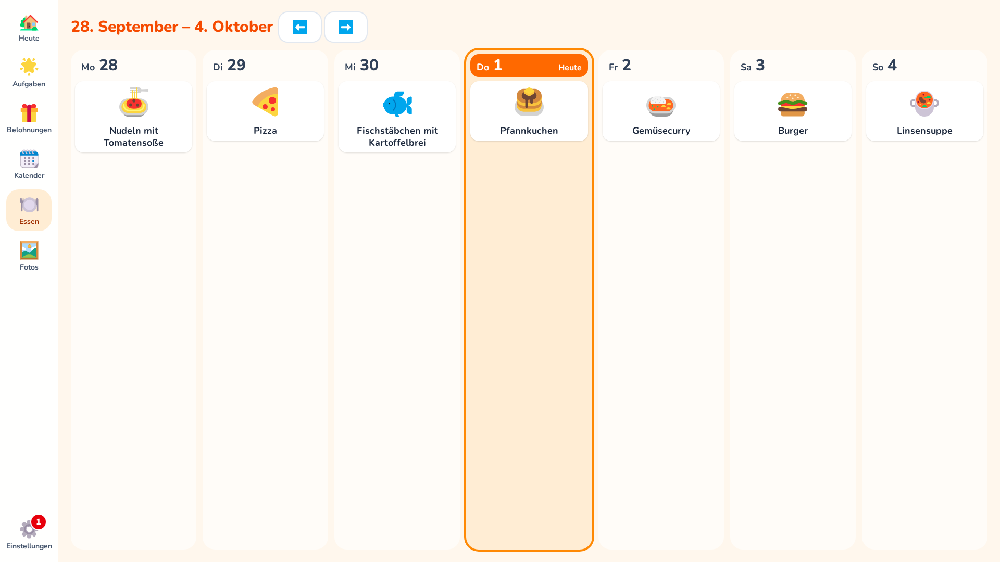

Unter **Essen** (Teller mit Besteck) in der Navigationsleiste steht der Essensplan der Woche,
Montag bis Sonntag, heute hervorgehoben. Die Pfeile blättern zu anderen Wochen.

- **Eintragen geht ohne Eltern-PIN**, direkt am Display oder am Handy: auf das **+** eines Tages
  tippen, dann ein Gericht aus den Vorschlägen antippen oder den Namen eintippen und „Speichern“.
- **Vorschläge:** zuerst eure eigenen Gerichte (zuletzt geplante vorne), dann rund 50 gängige
  Gerichte wie Nudeln mit Tomatensoße, Schnitzel, Maultaschen oder Abendbrot. Beim Tippen werden
  sie gefiltert.
- **Symbol:** kommt automatisch zum Namen (z. B. „Schnitzel mit Reis“ → Fleisch, sonst ein Teller)
  und lässt sich per Tipp darauf ändern. Das Symbol gehört zum Gericht und gilt überall, wo es
  geplant ist.
- Ein eingetipptes Gericht merkt sich FamQuest und schlägt es danach wieder vor. Gleiche Namen in
  anderer Schreibweise sind dasselbe Gericht.
- Ein Tipp auf ein geplantes Gericht ändert es; „Aus dem Plan nehmen“ leert den Tag wieder.
- **Eigene Gerichte bearbeiten:** Der Stift an einem eigenen Gericht in den Vorschlägen öffnet
  Name, Symbol und **Foto**. Bei einem schon geplanten Gericht geht es schneller: antippen und
  unten **„Foto für …“** wählen. Ein Foto (am Handy auch direkt aus der Kamera) wird quadratisch
  zugeschnitten, auf 512 × 512 verkleinert, ohne Metadaten gespeichert und ersetzt dann überall das
  Symbol, auch auf „Heute“. „Gericht löschen“ entfernt es aus den Vorschlägen und aus vergangenen
  Wochen; steht es heute oder später im Plan, muss es dort zuerst heraus.

Standardmäßig wird nur das **Abendessen** geplant. Im Elternbereich unter **Einstellungen →
Essensplan** lassen sich Frühstück, Mittagessen und Snack zuschalten (für die ganze Familie); dann
steht an jedem Tag jede Mahlzeit mit ihrem Symbol. Ausgeschaltete Mahlzeiten bleiben gespeichert.

## Einkaufsliste

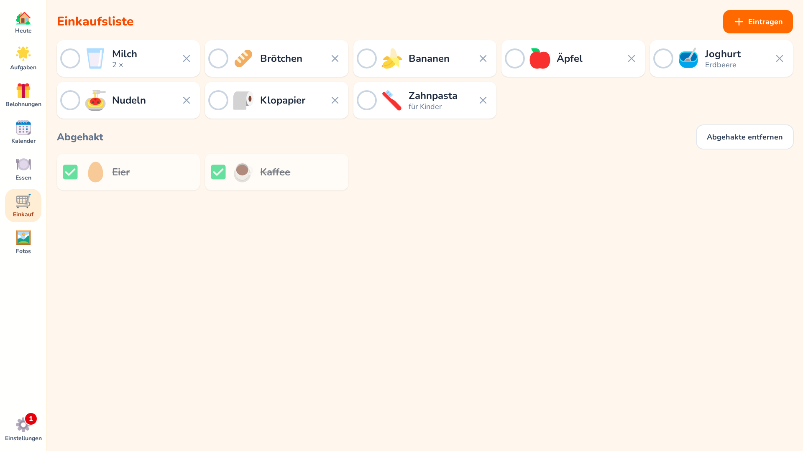

Unter **Einkauf** (Einkaufswagen) in der Navigationsleiste steht, was fehlt, in großen Zeilen mit
Symbolen.

- **Ohne Eltern-PIN**, am Display oder im Browser am Handy. **„Eintragen“** öffnet „Was fehlt?“:
  einen Vorschlag antippen oder einen Namen eintippen, optional mit **Menge oder Hinweis** („2 ד,
  „laktosefrei“), dann „Hinzufügen“. Der Dialog bleibt offen, damit mehrere Artikel hintereinander
  dazukommen; „Fertig“ schließt ihn.
- **Vorschläge:** zuerst eure eigenen Artikel (häufig gekaufte zuerst), dann rund 65 gängige wie
  Milch, Brötchen, Bananen, Klopapier oder Windeln. Was schon auf der Liste steht, trägt einen
  Haken; **nochmal antippen** nimmt es wieder herunter. Tippen filtert die Vorschläge.
- **Symbol:** kommt automatisch zum Namen („Rote Zwiebeln“ → Zwiebel, sonst Einkaufstüten) und lässt
  sich per Tipp darauf ändern. Der Stift an einem eigenen Artikel benennt ihn um, ändert das Symbol
  oder löscht ihn.
- **Abhaken:** ein Tipp auf eine Zeile hakt ab, ein weiterer nimmt es zurück. Abgehakte stehen
  durchgestrichen darunter, **bis der Tag vorbei ist** (in der Zeitzone der Familie), damit sich ein
  falscher Tipp im Laden noch zurücknehmen lässt; danach verschwinden sie von selbst. „Abgehakte
  entfernen“ räumt sie sofort weg, das × nimmt einen Artikel von der Liste.
- Die Liste lädt alle 30 Sekunden neu; so sieht das Display, was jemand am Handy eingetragen hat.

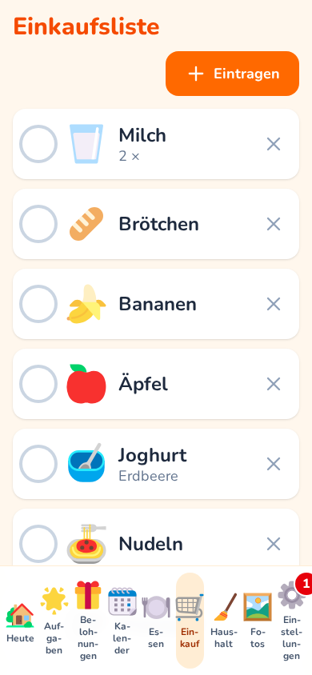

**Am Handy:** FamQuest im Browser öffnen. Unterwegs muss FamQuest dafür von außen erreichbar sein,
z. B. per HTTPS hinter einem Reverse Proxy (siehe [Hinter einem Reverse Proxy](#hinter-einem-reverse-proxy))
oder über ein VPN. Eine installierbare App, die im Laden auch ohne Netz funktioniert, ist für 1.4
geplant.

## Haushalt

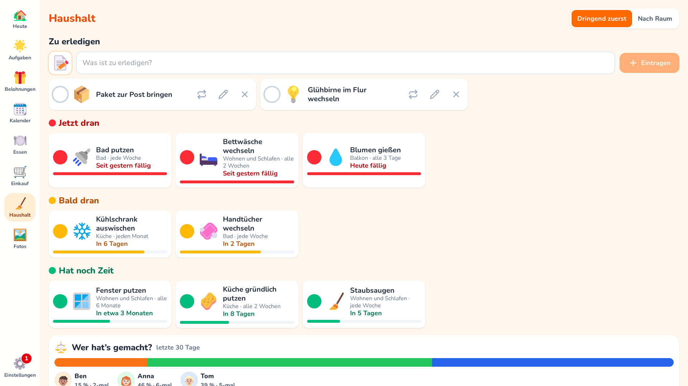

Unter **Haushalt** (Besen) in der Navigationsleiste steht der Putzplan: wiederkehrende Hausarbeit
ohne festen Termin. Jede Aufgabe hat ihren eigenen Abstand („alle 2 Wochen“, „alle 3 Monate“), und
eine Ampel zeigt, wie dringend sie ist.

- **Ampel:** grün heißt „hat noch Zeit“, gelb „bald dran“ (ab 70 % des Abstands, frühestens zwei
  Wochen vorher), rot „jetzt dran“. Der Balken unter jeder Zeile füllt sich bis zur Fälligkeit.
  Die Uhr läuft **ab dem letzten Erledigen**, nicht nach Kalender; Verpasstes stapelt sich nicht,
  eine Aufgabe ist einfach „seit 5 Tagen fällig“.
- **Erledigen:** ein Tipp auf die Zeile, **ohne Eltern-PIN**. Danach fragt eine Leiste kurz
  **„Wer war's?“**: einen Avatar antippen, „Rückgängig“ wählen oder einfach nichts tun. Heute
  Erledigtes steht blass darunter; ein weiterer Tipp nimmt es zurück.
- **Sortierung:** „Dringend zuerst“ (Jetzt dran, Bald dran, Hat noch Zeit) oder „Nach Raum“.
- Hausarbeit gehört dem Haushalt, nicht einer Person. Wer gerade Zeit hat, macht es.
- **Auch auf „Heute“ und unter „Aufgaben“:** Was rot oder gelb ist, steht als Kachel „Haushalt“
  auf der Startseite und als eigene Spalte „Haushalt“ neben den Kindern unter **Aufgaben**, jeweils
  zum Abhaken mit einem Tipp. Grünes zeigt nur diese Ansicht. Die Kachel bleibt klein, damit die
  Woche Platz hat: Sie zeigt die zwei dringendsten Einträge, der Rest steht als „+3 weitere“ dabei, und Erledigtes
  verschwindet (zurücknehmen über „Rückgängig“ in der Leiste „Wer war's?“ oder in dieser Ansicht).
  Über der Spalte stehen die Ampel in Zahlen und die [faire Verteilung](#faire-verteilung).

### Zu erledigen

Ganz oben in der Ansicht **Haushalt** steht **„Zu erledigen“**: eine gemeinsame Liste für alles
Einmalige ohne Person und Termin, etwa „Hühnerfutter holen“ oder „Glühbirne wechseln“. Sie braucht
keine Eltern-PIN.

- **Eintragen:** Text eintippen und „Eintragen“ antippen. Das Symbol wird aus dem Text
  vorgeschlagen; ein Tipp darauf öffnet die Symbolauswahl. Dasselbe steht nicht zweimal offen auf
  der Liste.
- **Abhaken:** ein Tipp auf die Zeile. Wie im Putzplan fragt danach kurz die Leiste
  **„Wer war's?“**; die Angabe zählt in die [faire Verteilung](#faire-verteilung). Abgehaktes
  bleibt bis zum Ende des Tages durchgestrichen stehen, ein weiterer Tipp nimmt es zurück.
- **Ändern:** Der Stift an einem offenen Eintrag macht Text und Symbol änderbar; der Haken
  speichert, das ✕ bricht ab.
- **Streichen:** Das ✕ an einem offenen Eintrag nimmt ihn von der Liste, ohne ihn zu erledigen.
- **Kommt wieder:** Stellt sich heraus, dass etwas regelmäßig anfällt, macht der Knopf mit den
  zwei Pfeilen daraus eine Aufgabe im Putzplan. Er führt in den Elternbereich (Eltern-PIN); Titel
  und Symbol sind schon eingetragen, ihr wählt Raum und Abstand. Dafür muss es mindestens einen
  Raum geben.
- **Auch auf „Heute“ und unter „Aufgaben“:** Offenes steht in der Kachel „Haushalt“ vor dem
  Putzplan und oben in der Haushalt-Spalte, jeweils zum Abhaken. Beides erscheint auch ohne
  Putzplan, sobald etwas auf der Liste steht.

### Putzplan einrichten

Im Elternbereich unter **Haushalt**. Am schnellsten geht es mit **„Assistent starten“**:

1. Ein paar Fragen: Wohnung oder Haus, wie viele Bäder, dazu Schalter für Garten, Balkon oder
   Terrasse, Saugroboter, Spülmaschine, Trockner, Haustiere, Auto, Kamin oder Ofen, Kinderzimmer
   sowie Papierkram und Technik. Mit **„Wie gründlich soll es sein?“** (locker, normal, gründlich)
   werden alle Abstände länger oder kürzer.
2. Der Vorschlag zeigt Räume mit Aufgaben und Abständen. Angehakt ist nur das Mindeste (je nach
   Zuhause etwa 10 bis 20 Aufgaben), damit der Plan am Anfang überschaubar bleibt. Antippen, was
   ihr zusätzlich möchtet, abwählen, was nicht passt, dann „Aufgaben übernehmen“.

Geputzt wird je Raum am Stück („Bad putzen“, „Küche gründlich putzen“); eigene Aufgaben gibt es nur
für das, was seltener dran ist, etwa „Abflüsse reinigen“ oder „Backofen reinigen“.

Zwei Bäder im Haus heißen „Bad oben“ und „Bad unten“ und haben getrennte Aufgaben, damit ihr das
selten genutzte Bad seltener putzen könnt; ein drittes zählt als Gäste-WC. Mit Saugroboter schlägt
der Assistent statt „Staubsaugen“ das Leeren und Reinigen des Roboters und „Ecken, Treppe und unter
Möbeln saugen“ vor. Damit nicht alles am selben Tag fällig wird, verteilt er den Start über die
Abstände. Ihr könnt ihn später erneut starten: Vorhandenes bleibt, wie es ist.

Danach lässt sich alles von Hand ändern:

- **Raum anlegen / bearbeiten:** Name und Symbol frei wählbar. Wer einen Raum löscht, löscht seine
  Aufgaben mit.
- **Aufgabe hinzufügen / bearbeiten:** Titel, Symbol, Raum und **„Wie oft?“** als Zahl mit Tagen,
  Wochen, Monaten oder Jahren. Bei neuen Aufgaben wählt ihr den Stand: gerade erledigt, mittendrin,
  jetzt fällig oder ein Datum. Ein geänderter Abstand zählt ab dem letzten Erledigen.
- **Zuletzt erledigt:** Das Datum lässt sich jederzeit von Hand setzen, damit eine Aufgabe nicht
  bei null anfängt. Beispiel: Fenster vor zehn Wochen geputzt, dran jedes halbe Jahr → Datum
  eintragen, darunter steht, wann sie wieder fällig ist. Ein Tag in der Zukunft geht nicht. Liegt
  das Datum vor einer schon abgehakten Erledigung (etwa versehentlich getippt), wird diese gelöscht.
- **Pausieren:** Der Schalter an einer Aufgabe blendet sie am Display aus, ohne sie zu löschen
  (z. B. „Rasen mähen“ im Winter).

Die Vorlagen stehen in `frontend/src/pools/chores.ts`, ihre Namen in
`frontend/src/locales/<sprache>/pool.json`.

Der Putzplan hat die früheren Aufgaben der Erwachsenen abgelöst: Aufgaben gibt es nur noch für
Kinder. **Beim Update** werden Aufgaben gelöscht, die ausschließlich Erwachsenen zugeordnet waren
(mit ihren Erledigungen); bei Aufgaben für Kinder und Erwachsene fällt nur die Zuordnung der
Erwachsenen weg. Punktebuchungen bleiben erhalten. Legt vorher ein [Backup](#backup-und-restore)
an, wenn ihr die alten Aufgaben noch nachschlagen wollt. Ein Kind lässt sich erst zum Erwachsenen
machen, wenn es keine Aufgaben und Routinen mehr hat.

## Fotos (Bilderrahmen)


Im Elternbereich unter **Fotos** (Symbol Bilderrahmen) ladet ihr die Fotos für den Bilderrahmen
hoch.

- **Fotos hinzufügen** wählt mehrere Fotos auf einmal, am Handy direkt aus der Galerie. Sie gehen
  nacheinander hoch; ein Balken zeigt den Fortschritt. Scheitert ein Foto, steht es mit Grund in
  einer Liste, die anderen kommen trotzdem an.
- Möglich sind JPEG, PNG und WebP bis 25 MB. iPhones wandeln HEIC-Fotos beim Hochladen meist selbst
  in JPEG um.
- Der Server prüft jedes Foto, dreht es richtig herum, verkleinert es auf höchstens 2560 Pixel an
  der langen Kante und speichert es neu als WebP. Dabei fallen Ortsangaben (GPS) und andere
  Metadaten weg; nur das Aufnahmedatum wird vorher übernommen und unter dem Foto angezeigt.
- Mit **Zeigen** blendet ihr ein Foto aus oder wieder ein, ohne es zu löschen. **Löschen** (Mülleimer)
  fragt vorher nach.

Die Fotos liegen im Volume `uploads` (Unterordner `photos`), sind nur mit Anmeldung abrufbar und
werden vom [Backup](#backup-und-restore) mit erfasst.

**Der Bilderrahmen am Display**

- Sobald mindestens ein Foto gezeigt wird, erscheint in der Navigationsleiste das Symbol **Fotos**
  (gerahmtes Bild). Es startet den Bilderrahmen.
- Die Fotos erscheinen im Vollbild in zufälliger Reihenfolge mit weicher Überblendung,
  standardmäßig eines pro Minute. Jedes Foto kommt einmal dran, bevor sich eines wiederholt.
- Fotos, die ungefähr zum Bildschirm passen, füllen ihn aus. Hochformat und stark abweichende
  Formate erscheinen ganz, dahinter dasselbe Foto unscharf statt schwarzer Balken.
- Ein Tipp irgendwohin beendet den Bilderrahmen und führt zu „Heute“. Dieser Tipp hakt nichts ab.
- **Start nach Leerlauf** stellt ihr je Gerät ein: **Einstellungen → Dieses Gerät → Bilderrahmen
  nach Leerlauf** (aus, 1, 5, 10 oder 30 Minuten; standardmäßig aus). Am Küchendisplay einschalten,
  auf den Eltern-Handys aus lassen. Er startet nur aus den Alltagsansichten, nicht im Elternbereich.

**Einblendungen und Anzeigedauer**

Im Elternbereich unter **Fotos** legt die Karte **Bilderrahmen** fest, was unten über den Fotos
erscheint. Die Einstellungen gelten für die ganze Familie und wirken sofort.

- **Uhr und Datum** (unten links, groß), **Wetter** (unten rechts, Symbol und Temperatur) und
  **Nächster Termin** (unter der Uhr, mit dem Avatar der Person, der er gehört) sind standardmäßig an.
- **Offene Aufgaben** ist standardmäßig aus. Eingeschaltet erscheint jede Person, die heute noch
  etwas offen hat, mit ihrem Avatar und den Symbolen dieser Aufgaben (bis zu vier, dann „+n“). So
  sehen auch Kinder auf einen Blick, was noch fehlt. Extras und optionale Routinenschritte zählen
  nicht. Die Einblendungen lassen sich nicht antippen: Ein Tipp führt weiterhin nur zu „Heute“.
- **Jedes Foto zeigen für**: 15 oder 30 Sekunden, 1, 2 oder 5 Minuten (Standard 1 Minute, eher
  ruhig als hektisch).
- Wetter und Termine erscheinen erst, wenn ein Ort bzw. ein Kalender eingerichtet ist.

**Nachtmodus**

Auf derselben Karte sorgt der **Nachtmodus** dafür, dass nachts keine Fotos laufen. Er ist
standardmäßig aus.

- **Von** und **Bis** legen das Zeitfenster in der Zeitzone der Familie fest; es darf über
  Mitternacht gehen (Standard 22:00 bis 06:00). Sind beide Zeiten gleich, greift der Nachtmodus nie.
- **Schwarz**: Der Bildschirm bleibt ganz dunkel. **Gedimmte Uhr**: eine große, dunkelgraue Uhr auf
  Schwarz. Sie wandert alle 5 Minuten ein Stück, damit sie sich nicht einbrennt.
- Nachts gibt es keine Einblendungen, und es werden keine Fotos geladen. Am Morgen laufen die Fotos
  von selbst weiter.
- Ein Tipp führt weiterhin zu „Heute“. Auf Geräten mit **Start nach Leerlauf** kommt der
  Nachtbildschirm nach der Leerlaufzeit zurück; auf Geräten ohne erscheint er nur, wenn der
  Bilderrahmen gestartet wird.

Ein Browser kann die Hintergrundbeleuchtung nicht abschalten: Auch „Schwarz“ leuchtet noch leicht.
Um das Display wirklich auszuschalten, braucht es einen Befehl auf dem Rechner am Display, z. B.
per cron:

```cron
# Wayland (z. B. aktuelles Raspberry Pi OS): um 22:00 aus, um 06:00 an
0 22 * * * WAYLAND_DISPLAY=wayland-1 XDG_RUNTIME_DIR=/run/user/1000 wlr-randr --output HDMI-A-1 --off
0 6  * * * WAYLAND_DISPLAY=wayland-1 XDG_RUNTIME_DIR=/run/user/1000 wlr-randr --output HDMI-A-1 --on

# X11
0 22 * * * DISPLAY=:0 xset dpms force off
0 6  * * * DISPLAY=:0 xset dpms force on
```

Welcher Befehl funktioniert, hängt vom Gerät und vom Desktop ab; `wlr-randr` ohne Argumente zeigt
die Namen der Ausgänge. Auf älterem Raspberry Pi OS ohne KMS-Treiber geht auch
`vcgencmd display_power 0`/`1`.

## Konfiguration

Die Konfiguration erfolgt ausschließlich über Umgebungsvariablen in `.env`. Alle Variablen sind in
[`.env.example`](.env.example) beschrieben.

| Variable | Standard | Bedeutung |
| --- | --- | --- |
| `POSTGRES_USER` | `famquest` | Datenbank-Benutzer |
| `POSTGRES_PASSWORD` | – (Pflicht) | Datenbank-Passwort |
| `POSTGRES_DB` | `famquest` | Name der Datenbank |
| `APP_PORT` | `8080` | Port auf dem Host |
| `LOG_LEVEL` | `info` | `critical`, `error`, `warning`, `info`, `debug` (zur Fehlersuche) |
| `FORWARDED_ALLOW_IPS` | `127.0.0.1` | Vertrauenswürdige Reverse Proxies |
| `PROXY_NETWORK` | `proxy` | Docker-Netzwerk eures Reverse Proxys (siehe unten) |
| `GOOGLE_CLIENT_ID` | – | OAuth-Client für den [Google Kalender](#google-kalender) |
| `GOOGLE_CLIENT_SECRET` | – | Clientschlüssel dazu |
| `TOKEN_ENCRYPTION_KEY` | – | Verschlüsselt die Google-Tokens in der Datenbank |
| `PUBLIC_URL` | – | Öffentliche Adresse, z. B. `https://familie.example.com`; legt die Google-Weiterleitungs-URI hinter einem Reverse Proxy fest |
| `CALENDAR_SYNC_MINUTES` | `5` | Minuten zwischen zwei Kalender-Synchronisationen im Hintergrund; `0` = aus |

Daten liegen in zwei Docker-Volumes: `db-data` (PostgreSQL) und `uploads` (hochgeladene Bilder).
Wie ihr sie sichert, steht unter [Backup und Restore](#backup-und-restore).

## Backup und Restore

Zu sichern sind die **Datenbank** und die **hochgeladenen Bilder**. Beides geht im laufenden
Betrieb, im Projektordner (dort, wo `docker-compose.yml` liegt):

```sh
mkdir -p backup
# Datenbank (PostgreSQL-Dump im Custom-Format)
docker compose exec -T db sh -c 'pg_dump -U "$POSTGRES_USER" -d "$POSTGRES_DB" --format=custom' \
  > backup/famquest-$(date +%F).dump
# Bilder
docker compose exec -T app tar czf - -C /data uploads > backup/uploads-$(date +%F).tar.gz
```

Legt die Dateien zusätzlich außerhalb des Rechners ab (NAS, externe Platte). Die `.env` gehört
ebenfalls dazu, sie liegt aber nicht im Repository.

**Wiederherstellen**, z. B. auf einem neuen Rechner nach `git clone` und `cp .env.example .env`
(mit denselben `POSTGRES_*`-Werten):

```sh
docker compose up -d db
# Datenbank einspielen (vorhandene Tabellen werden ersetzt)
docker compose exec -T db sh -c \
  'pg_restore -U "$POSTGRES_USER" -d "$POSTGRES_DB" --clean --if-exists --no-owner' \
  < backup/famquest-2026-10-03.dump
# Bilder einspielen
docker compose run --rm -T --no-deps --entrypoint tar app xzf - -C /data \
  < backup/uploads-2026-10-03.tar.gz
docker compose up -d
```

Beim Start bringt die App die Datenbank per Migration auf den neuesten Stand. Ein Backup einer
älteren Version lässt sich also in eine neuere einspielen, nicht umgekehrt.

Beides zusammen erledigt `scripts/backup.sh [ZIELORDNER] [TAGE]` (Standard: `backup/`, Backups
älter als 30 Tage werden gelöscht). Für ein nächtliches Backup per Cronjob:

```
0 3 * * * /pfad/zu/famquest/scripts/backup.sh /mnt/nas/famquest 30
```

Der Benutzer des Cronjobs braucht Zugriff auf Docker (Gruppe `docker`).

## Hinter einem Reverse Proxy

### Proxy als Container in einem Docker-Netzwerk (z. B. Nginx Proxy Manager)

Läuft euer Proxy als Container in einem eigenen Docker-Netzwerk (z. B. `proxy`), diese beiden
Zeilen in die `.env` schreiben:

```sh
COMPOSE_FILE=docker-compose.yml:docker-compose.proxy.yml
PROXY_NETWORK=proxy
```

Danach `docker compose up -d`. Die App hängt dann in diesem Netzwerk und ist dort als
**`famquest`, Port `8000`** erreichbar. Auf dem Host wird kein Port mehr veröffentlicht, und
`FORWARDED_ALLOW_IPS` ist standardmäßig `*` (nur der Proxy erreicht die App). Im Nginx Proxy
Manager: neuer Proxy Host, Schema `http`, Forward Hostname `famquest`, Forward Port `8000`, dazu ein
SSL-Zertifikat. Nötig ist Docker Compose 2.24 oder neuer.

### Proxy auf dem Host oder einem anderen Rechner

Die App wertet `X-Forwarded-For` und `X-Forwarded-Proto` aus, aber nur von den Adressen in
`FORWARDED_ALLOW_IPS`. Das ist wichtig: Nur wenn die App erkennt, dass sie per HTTPS aufgerufen
wird, bekommt das Session-Cookie das `Secure`-Flag.

Empfohlene Einrichtung, wenn der Proxy auf demselben Host läuft:

```sh
# .env
APP_PORT=127.0.0.1:8080       # App nur für den lokalen Proxy erreichbar
FORWARDED_ALLOW_IPS=*         # vertretbar, weil niemand sonst direkt zugreifen kann
```

Läuft der Proxy auf einem anderen Rechner, dessen IP-Adresse in `FORWARDED_ALLOW_IPS` eintragen.
Hinweis: Durch das Docker-Port-Mapping sieht die App als Absender die Adresse des Docker-Netzwerks
(z. B. `172.18.0.1`), nicht `127.0.0.1`. Der Standardwert `127.0.0.1` gilt daher nur ohne Proxy.

Der Proxy muss den ursprünglichen `Host`-Header weitergeben (Caddy und Traefik tun das
automatisch, bei nginx `proxy_set_header Host $host;`). Setup und Login prüfen damit, dass die
Anfrage von der eigenen Seite kommt.

Fotos für den Bilderrahmen dürfen bis zu 25 MB groß sein. nginx erlaubt standardmäßig nur 1 MB pro
Anfrage; dort daher `client_max_body_size 30m;` setzen (im Nginx Proxy Manager unter „Advanced“).

Die App muss auf einer eigenen (Sub-)Domain laufen, z. B. `familie.example.com`. Ein Unterpfad wie
`example.com/familie` wird nicht unterstützt.

## Öffentliche Demo

Die Demo des Projekts läuft unter [demo-de.kaufmann.city](https://demo-de.kaufmann.city/) (Deutsch)
und [demo-en.kaufmann.city](https://demo-en.kaufmann.city/) (Englisch).

FamQuest lässt sich als öffentliche Demo betreiben, damit man es ohne Installation ausprobieren
kann: eine deutsche und eine englische Instanz mit der Beispielfamilie aus
[`backend/app/demo.py`](backend/app/demo.py), jede mit eigener Datenbank und getrennt von der
echten Installation.

```sh
docker compose -f docker-compose.demo.yml up -d --build
```

Die Instanzen lauschen auf `127.0.0.1:8081` (Deutsch) und `127.0.0.1:8082` (Englisch) für einen
Reverse Proxy auf dem Host (änderbar mit `DEMO_PORT_DE` und `DEMO_PORT_EN`). Läuft der Proxy in
einem Docker-Netzwerk, zusätzlich `-f docker-compose.demo.proxy.yml` angeben; die Instanzen sind
dort dann als `famquest-demo-de:8000` und `famquest-demo-en:8000` erreichbar (Netzwerk aus
`PROXY_NETWORK`). Jede bekommt ihre eigene Subdomain, z. B. `demo-de.example.com` und
`demo-en.example.com`.

Was der Demomodus (`DEMO_MODE=de` oder `en`) macht:

- Er legt die Beispielfamilie beim Start an und setzt sie zur vollen Stunde zurück
  (`DEMO_RESET_MINUTES`, Standard 60). Termine, Essen und Verlauf liegen relativ zu heute, Uhr und
  Wetter (Berlin) sind echt. In den wenigen Sekunden des Zurücksetzens meldet die App „Die Demo
  wird gerade zurückgesetzt“.
- Die Anmeldeseite zeigt die Eltern-PIN und einen Knopf „Demo öffnen“, ohne Passwort.
- Gesperrt ist, was anderen die Demo verderben würde: PIN ändern oder abschalten,
  Familieneinstellungen (Name, Sprache, Zeitzone), Bilder hochladen (Avatare, Fotos, Gerichte) und
  Google Kalender verbinden. Alles andere darf ausprobiert werden.

## Fehlersuche

**Anmeldung klappt nicht, obwohl das Passwort stimmen sollte.** Die App protokolliert, warum eine
Anmeldung abgelehnt wurde (`docker compose logs app`), z. B. `Anmeldung fehlgeschlagen: falsches
Passwort für Konto 1` oder `kein Konto mit dieser E-Mail`. Mit `LOG_LEVEL=debug` in der `.env`
(danach `docker compose up -d`) steht dort auch die eingegebene E-Mail-Adresse. Passwörter und PINs
werden nie protokolliert. Gibt ein Reverse Proxy den `Host`-Header nicht weiter, steht das ebenfalls
im Log.

**Google meldet `redirect_uri_mismatch` beim Verbinden.** Die Adresse, die FamQuest an Google
schickt, muss genau der **Autorisierten Weiterleitungs-URI** in der Google Cloud Console
entsprechen (Schema, Domain, Pfad). Der Elternbereich zeigt sie unter **Kalender → Einrichtung bei
Google**, außerdem steht sie im Log (`Weiterleitungs-URI: …`). Hinter einem Reverse Proxy beginnt
sie oft mit `http://` statt `https://`, weil die App den Headern des Proxys nicht vertraut
(`FORWARDED_ALLOW_IPS`, siehe [Hinter einem Reverse Proxy](#hinter-einem-reverse-proxy)). Am
einfachsten: in der `.env` `PUBLIC_URL` setzen, z. B. `PUBLIC_URL=https://familie.example.com`,
danach `docker compose up -d`.

**Passwort vergessen.** Einen Reset per E-Mail gibt es bewusst nicht; stattdessen auf dem Server:

```sh
docker compose exec app python -m app.cli users                             # Konten anzeigen
docker compose exec -it app python -m app.cli reset-password mama@example.org
```

Nach 5 Fehlversuchen ist die Anmeldung 15 Minuten gesperrt; ein Neustart der App
(`docker compose restart app`) hebt die Sperre sofort auf.

## Sprachen

Deutsch ist die Standardsprache. Ohne gespeicherte Auswahl richtet sich die App nach der
Browsersprache.

Übersetzungen liegen in `frontend/src/locales/<sprache>/<bereich>.json` (`common.json` für die
Oberfläche, `icons.json` für die Suchbegriffe der Symbole, `pool.json` für die Vorschläge von
Aufgaben und Belohnungen). So kommt eine neue Sprache hinzu:

1. Den Ordner `frontend/src/locales/de` kopieren, z. B. nach `frontend/src/locales/fr`
2. Alle Texte übersetzen
3. Den Sprachcode in `SUPPORTED_LANGUAGES` in `frontend/src/i18n.ts` ergänzen

Ein Test (`npm test`) prüft, dass jede Sprache genau dieselben Schlüssel hat und kein Text leer ist.
Fehler liefert die API als Codes (z. B. `common.not_found`), das Frontend übersetzt sie unter
`errors.*`.

## Entwicklung

Für die lokale Entwicklung laufen Backend und Frontend direkt auf dem Rechner, nur PostgreSQL läuft in
Docker. Voraussetzungen: [uv](https://docs.astral.sh/uv/), Node.js ≥ 24, Docker.

Einmalig:

```sh
cp .env.example .env
# In .env: POSTGRES_PASSWORD setzen und die Zeilen COMPOSE_FILE und DB_PORT einkommentieren
cd backend && uv sync && cd ..
cd frontend && npm install && cd ..
```

Starten (drei Terminals):

```sh
docker compose up -d db                              # PostgreSQL auf 127.0.0.1:5432
cd backend && uv run alembic upgrade head && uv run uvicorn app.main:app --reload
cd frontend && npm run dev                           # http://localhost:5173
```

Vite leitet `/api` an das Backend auf Port 8000 weiter. Die API-Dokumentation steht unter
`http://localhost:8000/api/docs`.

Tests und Lint:

```sh
cd backend && uv run pytest                          # braucht die laufende Datenbank
cd backend && uv run ruff check . && uv run ruff format --check .
cd frontend && npm test && npm run lint && npm run typecheck
cd frontend && npm run format                      # Formatierung (Prettier)
docker compose --profile test run --rm --build tests # Backend-Tests im Container
```

End-to-End-Tests der Familienansicht (Playwright, Chromium):

```sh
cd frontend && npx playwright install chromium       # einmalig
cd frontend && npm run e2e                           # braucht die laufende Datenbank
```

`npm run e2e` baut das Frontend, legt eine frische Datenbank `<POSTGRES_DB>_e2e` an und startet die
App auf Port 8001. Getestet werden die Hauptabläufe im Browser: Setup, Kind und Aufgaben anlegen,
abhaken und zurücknehmen, die Personenansicht am Smartphone, Punkte, Belohnungen, Kontrolle durch
die Eltern und flexible Aufgaben.

Die Backend-Tests legen eine eigene Datenbank `<POSTGRES_DB>_test` an und setzen sie bei jedem Lauf
neu auf.

Screenshots und Demodaten:

```sh
cd frontend && npm run screenshots                   # braucht die laufende Datenbank
```

`npm run screenshots` baut das Frontend und startet die App zweimal (Deutsch und Englisch), jeweils
mit frischer Datenbank `<POSTGRES_DB>_demo_<sprache>` und einer Beispielfamilie aus
[`backend/app/demo.py`](backend/app/demo.py): vier Personen mit Emoji-Avataren, Routinen, eine
Woche erledigter Aufgaben, Belohnungen, Essensplan, Einkaufsliste, Kalendertermine und einige gemeinfreie Fotos
([Quellen](backend/demo/photos/CREDITS.md)). Die Uhr der App steht auf Donnerstag der laufenden
Woche, 7:25 Uhr, das Wetter ist fest vorgegeben; so sehen die Bilder jedes Mal gleich aus. Die
Screenshots landen in `docs/screenshots/<sprache>/`. Die Demodaten lassen sich auch einzeln in eine
leere Datenbank laden: `cd backend && uv run python -m app.demo seed --lang de` (Anmeldung mit
`demo@famquest.example` / `famquest-demo`, PIN `1234`).

Migrationen:

```sh
cd backend
uv run alembic revision --autogenerate -m "beschreibung"   # neue Migration aus den Modellen
uv run alembic upgrade head                                 # anwenden
```

Ein Test schlägt fehl, wenn Modelle geändert wurden, ohne eine Migration anzulegen.

## Architektur

```
Browser ──► Reverse Proxy (optional) ──► app (FastAPI, Port 8000) ──► db (PostgreSQL 16)
                                           ├─ /api/*   JSON-API
                                           ├─ /*       gebautes React-Frontend
                                           ├─ /data/uploads (Volume)
                                           ├─ Kalender-Sync im Hintergrund ──► Google Calendar API
                                           └─ Wetter bei Bedarf (zwischengespeichert) ──► Open-Meteo
```

| Ordner | Inhalt |
| --- | --- |
| `backend/` | FastAPI, SQLAlchemy 2, Alembic, pytest; Pakete mit uv |
| `frontend/` | React, Vite, TypeScript, Tailwind CSS, react-i18next, TanStack Query, Vitest, Playwright |
| `docs/` | Spezifikation, Checkliste für den Display-Test, Projektseiten (GitHub Pages aus `main` → `/docs`) |
| `scripts/` | Backup-Skript |

Das `Dockerfile` baut zuerst das Frontend und kopiert es dann in das Python-Image. Es entsteht ein
einziges App-Image, das als unprivilegierter Benutzer läuft.

## Roadmap

Aktueller Stand: **1.1** ([Releases](https://github.com/craebby/FamQuest/releases)). Die Versionen
nach 1.1 sind ein erster Plan und können sich noch ändern.

**1.1: veröffentlicht.** Der Haushalt (Phase 7 unten): Putzplan mit Ampel statt der Aufgaben der
Erwachsenen, Einrichtungs-Assistent und „Zu erledigen“. Beim Update von 1.0 löscht die Migration
die Aufgaben, die nur Erwachsenen zugeordnet sind; vorher ein [Backup](#backup-und-restore) machen.

**1.0: veröffentlicht.** Alles unter [Features](#features), also die Phasen 1 bis 6 unten. Ihr
restlicher Feinschliff kommt aus dem Alltag als Updates 1.0.x.

**Aufgabensystem (Phase 1):** abgeschlossen; was der Display-Test
([Checkliste](docs/DISPLAY-TEST.md)) nicht abdeckt, wird im Alltag erprobt.

- [x] 1. Grundgerüst: Backend, Frontend mit i18n, Docker, Alembic, Healthchecks
- [x] 2. First-Run-Setup, Login/Logout, Sperre der Registrierung, Eltern-PIN
- [x] 3. Familienmitglieder mit Farbe und Profilbild
- [x] 4. Aufgaben und Routinen im Elternbereich
- [x] 5. Familienansicht
- [x] 6. Punkte und Tagesfortschritt
- [x] 7. Belohnungen, Aufgaben-Vorlagen, Kontrolle durch die Eltern, faire Verteilung
- [x] 8. Feinschliff: flexible Aufgaben und „Einer für alle“, Backup/Restore,
  Familien-Einstellungen, Anmeldung abgesichert, Korrekturen aus dem Display-Test (kompakter,
  Reihenfolge der Personen, Anzeigegröße je Gerät). Alles Weitere muss sich erst in der Praxis
  zeigen.

**Google Kalender (Phase 2):** fertig.

- [x] 1. Google-Konto verbinden (OAuth, Tokens verschlüsselt, automatisch erneuert)
- [x] 2. Kalender auswählen und Personen oder „Familie“ zuordnen (mit eigener Farbe)
- [x] 3. Synchronisation im Hintergrund (inkrementell), Serien- und ganztägige Termine,
  Fehlerbehandlung
- [x] 4. Kalenderansicht: Woche mit Terminen in Personenfarbe und Avataren
- [x] 5. Feinschliff: Termindetails per Tipp, ganztägige Termine im gleichen Stil, Feiertage und
  Schulferien je Bundesland, `PUBLIC_URL` für die Google-Weiterleitungs-URI
- [x] 6. Nachträglich eingeschoben: Symbole für Termine (Begriffe im Titel → Symbol, Vorschläge,
  Schalter je Person), damit Kinder ihre Termine ohne Lesen erkennen

**In Arbeit: Tages-Dashboard „Heute“ (Phase 3)**

- [x] 1. Aufgaben bekommen einen eigenen Bereich: Die Familienansicht zieht nach „Aufgaben“ (Stern),
  „Heute“ bekommt das Haus
- [x] 2. Wetter: Ort im Elternbereich festlegen, Vorhersage von Open-Meteo
- [x] 3. Startseite „Heute“: Uhr, Wetter, die nächsten 5 Termine, Aufgaben aller als antippbare
  Symbole, Platz für Essen und Einkauf
- [x] 4. Wochenansicht im Aufgabenbereich (was kommt noch, was ist erledigt); Routinen in fester
  Reihenfolge je Person und freiwillige Extra-Aufgaben
- [x] 5. Startseite konfigurierbar: Zahnrad auf „Heute“ (mit Eltern-PIN), Kacheln ein/aus und
  Reihenfolge, gilt für die ganze Familie; Wochen-Widget als optionale Kachel
- [x] 6. Routinenverwaltung: eigener Abschnitt „Routinen“ im Elternbereich, je Kind morgens,
  nachmittags und abends als Blöcke in fester Reihenfolge; geht später im Abschnitt „Aufgaben“ auf
- [x] 7. Elternbereich mit Menü: sieben Bereiche, am Tablet Leiste links, am Handy unten mit
  „Mehr“
- [x] 8. Routinen als eigene Blöcke: je Kind, Tagesabschnitt und Wochentagen (z. B. abgespeckter
  Abend am Wochenende), nummerierte und optionale Schritte, auf ein anderes Kind kopieren
- [ ] 9. Feinschliff am echten Display; alltagsnahe Aufgaben-Vorlagen und Belohnungs-Vorschläge
  (erledigt); das Wochen-Widget der Startseite ist mit dem Wochen-Dashboard (Phase 5, Etappe 3)
  entfallen

**Bilderrahmen (Phase 4)**

Das Display wird im Leerlauf zum digitalen Bilderrahmen.

- [x] 1. Fotos verwalten: im Elternbereich mehrere Fotos auf einmal hochladen (am Handy aus der
  Galerie), verkleinert und ohne Metadaten gespeichert, ein- und ausblenden, löschen
- [x] 2. Bilderrahmen: Vollbild mit Überblendung, zufällige Reihenfolge ohne Wiederholung,
  Hochformat mit unscharfem Hintergrund; Start per Symbol in der Navigationsleiste oder nach
  Leerlauf (je Gerät einstellbar), ein Tipp führt zurück zu „Heute“
- [x] 3. Einblendungen: Uhr und Datum, Wetter, nächster Termin, offene Aufgaben, jeweils ein- und
  ausschaltbar; Anzeigedauer je Foto (gilt für die Familie)
- [x] 4. Nachtmodus: Zeitfenster, dunkler Bildschirm oder gedimmte Uhr
- [ ] 5. Feinschliff am echten Display

**Screenshots:** fertig. Screenshots vom Display, vom Elternbereich und vom Handy in dieser README,
erzeugt mit Demodaten (`npm run screenshots`).

**Demoversion:** fertig. Eine deutsche und eine englische öffentliche Instanz mit der
Beispielfamilie, die sich zur vollen Stunde zurücksetzt (siehe [Öffentliche Demo](#öffentliche-demo)).

**1.2: Küchenansicht (Phase 8), in Arbeit**

- [x] 1. Küchenansicht unter `/kitchen` für ein 8-Zoll-Tablet im Querformat: Termine und Essen der
  nächsten Tage, per Wisch Routine der Kinder, Haushalt und Einkauf, Kopf mit Datum, Wetter und
  Uhr, Nachtmodus; dazu im Essensplan der Knopf „Foto für …“ direkt beim geplanten Gericht
- [ ] 2. Feinschliff am echten Tablet

**1.3: Anpassen**

- Vorlagen bearbeiten: Familien können Aufgaben-Vorlagen und Belohnungs-Vorschläge ändern,
  ergänzen und entfernen (in der Datenbank statt im Code); überarbeitete Beispiel-Vorlagen
- Vorschläge nach Alter: Aufgaben-Vorlagen und Belohnungs-Vorschläge passend zum Alter der Kinder
  (z. B. Geburtsjahr je Kind; bei mehreren Kindern je Kind passende Vorschläge)
- Teenager-Stil: weniger kindliche Darstellung je Person für ältere Kinder
- Icon-Picker: „Beliebt“ nach tatsächlicher Nutzung; beliebte Icons auch in ihrer Kategorie
- Mehr Symbole: weitere Icons zur Auswahl für Aufgaben, Hausarbeit, Gerichte, Einkauf und Termine
- Mehr als sieben Personen (mehr Farben)
- About-Seite: Autor, Lizenz, Version und Prüfung auf Updates

**1.4: Unterwegs**

- Installierbare Web-App (PWA) fürs Smartphone der Eltern: Aufgaben prüfen, Punkte buchen und
  Aufgaben anlegen von unterwegs; die Einkaufsliste auch ohne Netz im Laden, abgeglichen, sobald
  wieder Verbindung besteht
- Erwachsene legen Aufgaben schnell direkt in der Familienansicht an, ohne Elternbereich

**Als Nächstes: Essensplanung (Phase 5)**

Die Mahlzeiten der Woche direkt am Display planen.

- [x] 1. Wochenplan: Symbol „Essen“ in der Navigationsleiste, Wochen blättern, das Gericht je Tag
  eintippen (Vorschläge aus bisherigen und rund 40 gängigen Gerichten, Symbol wird automatisch
  gewählt und lässt sich ändern); standardmäßig nur Abendessen, Frühstück, Mittag und Snack lassen
  sich in den Einstellungen zuschalten; die Kachel „Essen“ auf „Heute“ zeigt das heutige Essen
- [x] 2. Gerichte verwalten: umbenennen, Symbol ändern, Foto hochladen, löschen (über den Stift
  im Essensplan, ohne PIN)
- [x] 3. „Heute“ als Wochen-Dashboard: oben Uhr und Wetter klein, darunter die aktuelle Routine der
  Kinder und Platz für den Einkauf, unten breit die nächsten 7 Tage mit Terminen und Essen; Bereiche
  per Zahnrad ein- und ausschalten; Aufgaben der Erwachsenen nur noch unter „Aufgaben“
- [ ] 4. Feinschliff am echten Display

**In Arbeit: Einkaufsliste (Phase 6)**

- [x] 1. Einkaufsliste am Display und im Browser: Symbol „Einkauf“ in der Navigationsleiste,
  Artikel mit Vorschlägen und Symbolen eintragen (Menge oder Hinweis optional), abhaken, Abgehakte
  bleiben bis zum Ende des Tages; die Kachel „Einkauf“ auf „Heute“ zeigt, was fehlt
- [ ] 2. Feinschliff im Alltag

**Haushalt (Phase 7):** veröffentlicht mit 1.1, Feinschliff läuft im Alltag.

Die Aufgaben der Erwachsenen hat im Alltag niemand abgehakt. Sie werden durch einen Putzplan mit
Ampel ersetzt; die Routinen der Kinder bleiben.

- [x] 1. Putzplan: Räume, Aufgaben mit eigenem Abstand, Ansicht „Haushalt“ mit Ampel, ein Tipp
  erledigt, optional „Wer war's?“; Verwaltung im Elternbereich
- [x] 2. Einrichtungs-Assistent: Fragen zum Zuhause, daraus ein Vorschlag für Räume, Aufgaben und
  Abstände
- [x] 3. „Zu erledigen“: gemeinsame Liste für Einmaliges ohne Person und Termin (z. B.
  „Hühnerfutter holen“) oben in der Ansicht „Haushalt“, auch auf „Heute“ und unter „Aufgaben“; wer
  es macht, hakt ab; „kommt wieder“ macht daraus eine Aufgabe im Putzplan
- [x] 4. Kachel „Haushalt“ auf „Heute“ (nur Rotes und Gelbes, ein Tipp erledigt); unter „Aufgaben“
  ersetzt die Spalte „Haushalt“ die Spalten der Erwachsenen, die faire Verteilung speist sich aus
  dem Putzplan (vorgezogen vor Etappe 3)
- [ ] 5. Feinschliff im Alltag

**Ideen ohne Version**

- Termine in FamQuest anlegen und bearbeiten (braucht Schreibzugriff auf den Google Kalender statt nur lesend)
- Weitere Kalender: iCal-/ICS-Links und andere Anbieter (z. B. iCloud, Outlook, Nextcloud)
- Bilderrahmen: Fotos aus Immich (oder Nextcloud) statt nur hochgeladener Fotos, Alben
- Urlaubsmodus: Routinen für eine Zeit pausieren (z. B. im Urlaub) oder auf eine abgespeckte Version
  umschalten
- Rezepte zum Essensplan, z. B. durch Anbindung von [Mealie](https://mealie.io)
- Einkaufsliste: mehrere Listen (z. B. Supermarkt und Drogerie), Sortierung nach Kategorie oder
  Gang im Laden (eventuell mit KI), Zutaten aus dem Essensplan, Export nach Obsidian
  (Markdown-Checkliste)
- Essenswünsche der Kinder: am Display Avatar und Gericht antippen; die Eltern übernehmen den Wunsch
  in den Plan oder lehnen ab
- Haushalt: saisonale Aufgaben (z. B. Rasen mähen nur von April bis Oktober), Reihenfolge der Räume
  ändern, persönliche Todos je Person

- Symbole oder feste Farben für Wochentage (z. B. Montag immer grün, wie in vielen Kitas), damit
  sich Kinder, die noch nicht lesen können, in der Woche zurechtfinden
- Mehrere Familien auf einer Installation: z. B. legt der erste Admin (oder eine versteckte
  Funktion) befreundete Familien an und berechtigt sich darauf. Aktuell bedient FamQuest bewusst
  genau eine Familie pro Installation.

## Lizenz

Copyright © 2026 Craebby

FamQuest ist freie Software unter der [GNU Affero General Public License](LICENSE), Version 3 oder
(nach eurer Wahl) jeder späteren Version. Kurz gesagt: Ihr dürft FamQuest frei nutzen, verändern und
weitergeben, auch kommerziell. Wer eine veränderte Version weitergibt oder für andere über das Netz
betreibt, muss deren Quellcode unter derselben Lizenz veröffentlichen.

FamQuest wird ohne jede Gewährleistung bereitgestellt; Details stehen im Lizenztext (englisch). Die
mitgelieferten [Fluent-Emoji](https://github.com/microsoft/fluentui-emoji)-Symbole sind © Microsoft,
MIT-Lizenz.
