# FamQuest

**English** · [Deutsch](README.de.md)

A self-hosted, bilingual (English/German) family app for a touchscreen display on the fridge:
**routines → tasks → done → points → rewards.**

One installation belongs to exactly one family. Everything runs locally in Docker, without cloud
services and without external CDNs. The full specification (in German) is in
[`docs/SPEC.md`](docs/SPEC.md).

> **Status:** version 1.0. Contains the task system (routines, family view, points, rewards,
> parent checks), Google Calendar (read-only), the start page "Today" as a week dashboard with
> weather, the picture frame with night mode, the meal plan and the shopping list. Polish continues
> in everyday use (see [Roadmap](#roadmap)).

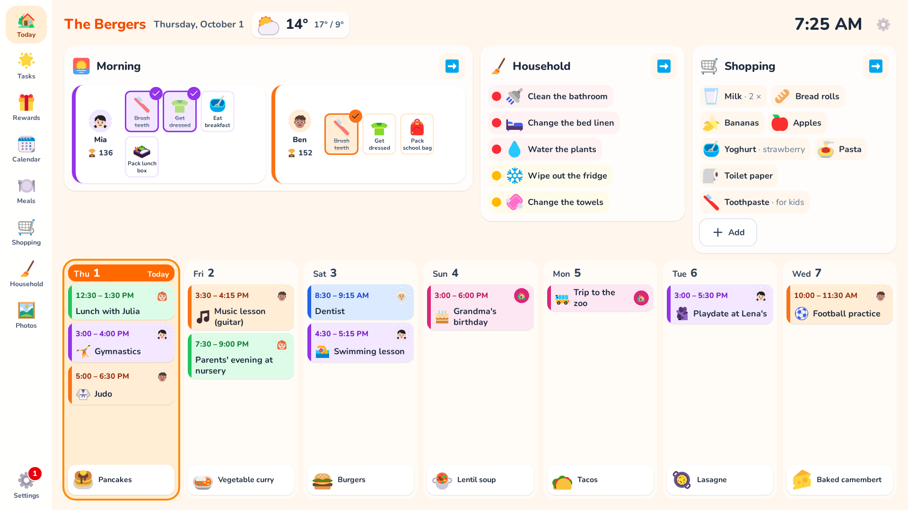

| Tasks this week | Event details | Symbols for events | On the phone |
| --- | --- | --- | --- |
| 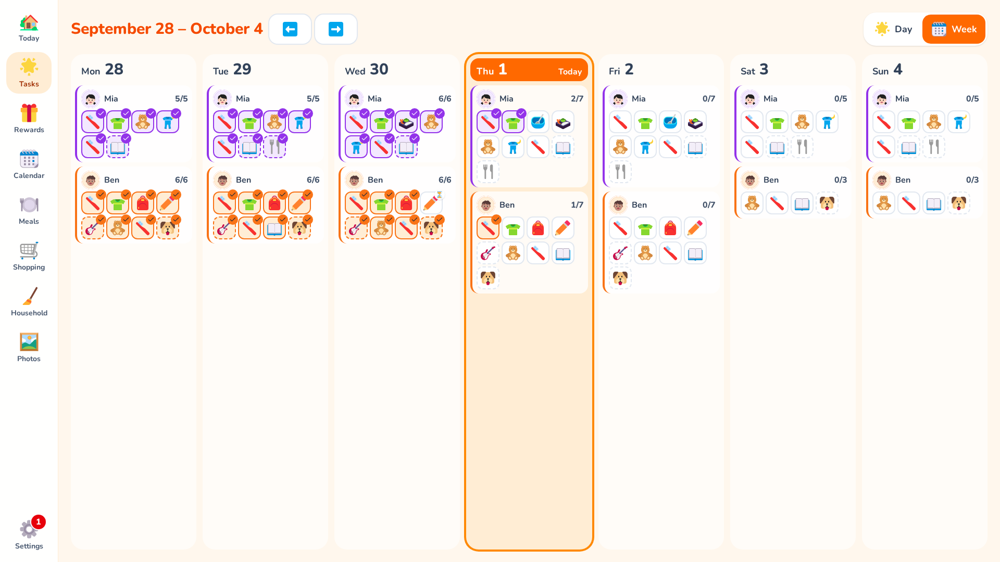 | 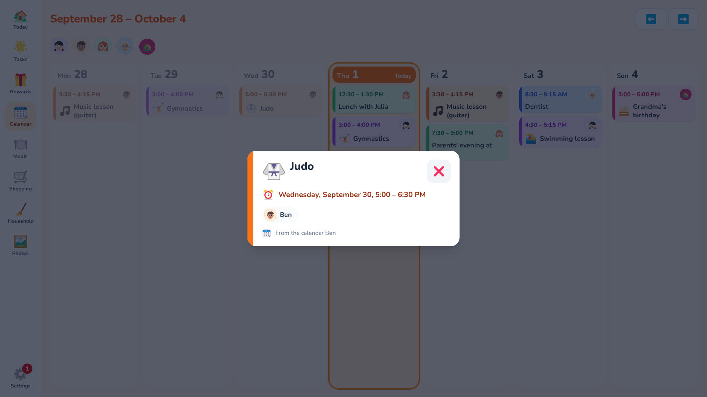 | 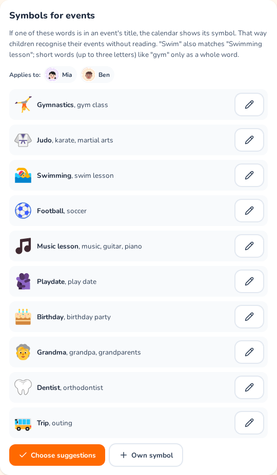 | 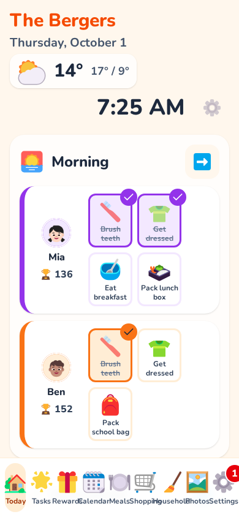 |

The screenshots show a sample family (demo data, see [Development](#development)).

## Features

- "Today" as a week dashboard: clock and weather, the children's current routine and the next seven
  days with events and meals
- Tasks with one column per child and the household next to them; one tap marks a task done
- Routines (daily, specific weekdays, Mon–Fri, once, flexible "about every X days") and times of day
- Routines in a fixed order per person, optional extra tasks in their own block
- "One for all" tasks: done by one child, done for everyone (e.g. setting the table)
- Points as ledger entries, daily progress, manual credits
- Rewards per child from a list of suggestions, redeemed on the display
- Parent checks for selected tasks
- Fair sharing: who did how much of the cleaning plan
- Google Calendar (read-only): week view on the display, events in each person's colour, symbols
  for children's events (e.g. judo, riding, playdate) so they recognise them without reading
- Weather for your town (Open-Meteo, no API key needed)
- Picture frame: uploaded photos full screen with cross-fades, started from an icon or when idle,
  with optional clock, weather, next event and open tasks on top, and a night mode (black or dimmed
  clock)
- Meal plan: type the week's dishes right on the display, with suggestions and icons
- Shopping list: add what's missing on the display or a phone (suggestions with icons, amount or
  note), tick it off in the shop
- Household: a cleaning plan with a traffic light instead of dates (every chore with its own
  interval, per room); a setup assistant suggests rooms, chores and intervals that fit your home;
  what is due also shows on "Today" and next to the children under "Tasks"
- Parents' area protected by a PIN
- Profile photos with cropping, one colour per person
- English and German; more languages via translation files

## Quick start on a Docker host

You only need Git and Docker with the Compose plugin on the host. The image builds frontend and
backend itself (multi-stage build), so no Node.js or Python is needed.

```sh
git clone https://github.com/craebby/FamQuest.git
cd FamQuest
cp .env.example .env
# Generate a random database password and write it into .env
sed -i "s|^POSTGRES_PASSWORD=.*|POSTGRES_PASSWORD=$(openssl rand -hex 24)|" .env
docker compose up -d --build
```

The first build takes a few minutes. Afterwards the app is available at `http://<host>:8080`
(port configurable via `APP_PORT` in `.env`). Database migrations run automatically when the app
container starts. Keep `.env` safe: it holds the database password and is needed for restores.

Check the status:

```sh
docker compose ps                        # both services should be "healthy"
curl http://localhost:8080/api/health    # {"status":"ok","database":"ok"}
```

Update:

```sh
git pull
docker compose up -d --build
```

`main` always has the latest state. For a fixed version, check out a
[release](https://github.com/craebby/FamQuest/releases) instead, e.g. `git fetch --tags && git checkout v1.0.2`,
then `docker compose up -d --build`.

On macOS, use `sed -i ''` instead of `sed -i`, or simply edit `.env` by hand.

## First start

On first visit the setup appears: language, family name, e-mail, password (entered twice) and the
parents' PIN.
The first account becomes the administrator. After that, setup is locked for good; no further
accounts can be registered through the interface.

- The display stays signed in permanently (the session is extended with every use, up to one year
  without use).
- The parents' area (gear icon) is additionally protected by the parents' PIN. After 2 minutes
  without input the display returns to the start page and locks it again.
- The parents' area has a menu with eight areas: **Checks & points** (with a red number when
  something is waiting), **Family**, **Tasks**, **Routines**, **Rewards**, **Photos**, **Calendar &
  weather** and **Settings** (family, PIN, device, account). On tablets and the display the menu is on the
  left; on phones the four most used areas are at the bottom and the rest is under **More**. Each
  area has its own address (e.g. `/parents/routines`), so reloading keeps you where you are.
- The PIN can be changed or switched off in the parents' area. Forgot the PIN? Set a new one with
  the account password.
- After 5 wrong attempts (password or PIN), further attempts are blocked for 15 minutes.
- Family name, family language and time zone can be changed under "Settings" in the parents' area.
  The time zone decides when a new day starts (default: Europe/Berlin).

## Family members

Under "Family" in the parents' area you add everyone in the household: name, role (parent
or child), colour and optionally a photo. Children need no account and no password.

- Each person has their own colour (orange, blue, purple, green, red, teal, yellow). Taken colours
  are greyed out, so at most seven people are possible for now.
- **Change order** sets the order in which people appear everywhere (columns, filters, rewards):
  with arrow buttons, or by dragging with the mouse.
- Pick a photo (on a phone also straight from the camera), move and zoom it in the circle, confirm.
  Without a photo, the avatar shows the initial on the person's colour.
- The image is cropped in the browser and checked by the server (JPEG, PNG or WebP only, at most
  5 MB), scaled to 512 × 512 px and re-encoded as WebP. Metadata such as GPS data is dropped. The
  images live in the `uploads` volume and can only be fetched when signed in.

## Tasks and routines

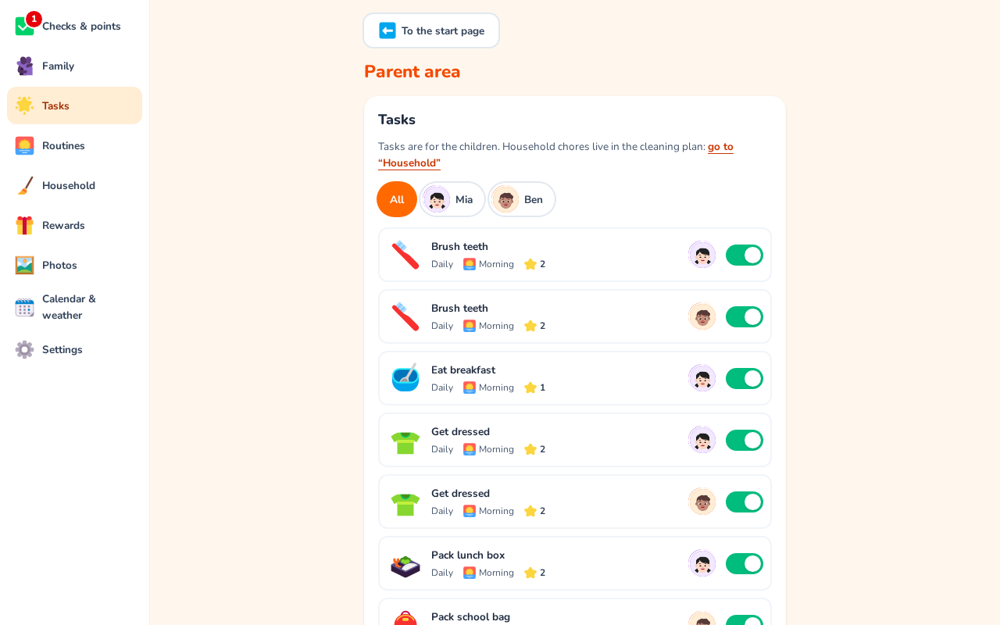

Under "Tasks" in the parents' area you decide who does what and when. A task has:

- **Icon**: from a bundled catalogue of about 200 colourful emoji icons
  ([Fluent Emoji](https://github.com/microsoft/fluentui-emoji), MIT licence), sorted into
  categories such as personal care, getting dressed, school or household. Search understands
  English and German ("tooth" and "Zahn" find the same toothbrush). Until you pick an icon
  yourself, the app suggests one that matches the title.
- **Title** and an optional description
- **Points**: 0 to 1000
- **For whom**: one or more children; each child completes the task and earns the points for
  themselves. With **"One for all"** (two or more children) it counts as done for everyone as soon
  as one child has done it, e.g. "Set the table" for siblings. The other columns show the avatar of
  whoever did it; the points go to that child. Adults don't get tasks: their housework lives in the
  cleaning plan (see [Household](#household)).
- **How often**: every day, on specific weekdays (with shortcuts Mon–Fri or weekend), once on a
  date, or **flexible** (see below)
- **When**: morning, midday, afternoon, evening, anytime or **Extra**. Tasks of one time of day
  form a **routine** in a fixed order (e.g. morning: brush teeth → get dressed → pack teddy);
  for children you set it up under [Routines](#routines).
  **Extras** are optional (e.g. clear the table): they have their own block at the end, earn
  points, but don't count towards the daily progress
- **Card colour**: the person's colour by default
- **Active**: inactive tasks are kept but don't appear in the family view
- **Parents check**: points are only given once you have confirmed the task (see
  [Parent checks](#parent-checks))

When creating a task, **"Choose from templates"** fills in the form with one tap: short everyday
routines for children (morning: brush teeth, get dressed, breakfast; after nursery or school: hang
up the backpack, unpack the lunchbox; evening: put toys away, pyjamas, brush teeth, off to bed)
plus optional extras (set the table, help with cooking …). Everything can be changed afterwards.
The templates live in `frontend/src/pools/tasks.ts`, their titles in
`frontend/src/locales/<language>/pool.json`. Templates for housework come with the setup assistant
in the [Household](#household) area.

The reward suggestions (`frontend/src/pools/rewards.ts`) only contain things a child doesn't get
anyway, e.g. a special breakfast wish, screen time, picking a movie, a special activity, money for
the piggy bank, something from the toy shop. Prices assume about 15–20 points a day; big rewards
(sleepover, day out, theme park, a big wish) are meant for saving up over several weeks.

**Flexible tasks** have no fixed day but a rhythm: every X days (shortcuts every 2 days, every
week, every 2 weeks, every month) and a date for the first time it is due. From then on the task
stays in the family view until it's done; when overdue, the card shows a red note with an alarm
clock ("due for 3 days"). After that it is due again X days after it was done. Before it is due,
it appears small under **"Coming up"** and can already be done early; the rhythm then restarts from
that day. "Coming up" does not count towards the daily progress.

The list can be filtered by tapping a person; new tasks are then preselected for that person.
Filtered by one person, the list shows that person's tasks in blocks exactly as on the display. The
switch in each row sets a task active or inactive. When a person is deleted their tasks are kept;
tasks without anyone assigned are marked in the list.

The icons are embedded into the frontend at build time (only the catalogue icons, not the whole
set). To extend the catalogue, add names from the `fluent-emoji-flat` set (e.g. from
[icon-sets.iconify.design](https://icon-sets.iconify.design/fluent-emoji-flat/)) to
`frontend/src/icons/categories.json` and search terms to
`frontend/src/locales/<language>/icons.json` (the first term is the label). Icons that the set lacks
(e.g. pyjamas) are put together from set icons in `frontend/src/icons/composed.json`. Tests check
that every icon exists and has a unique label in every language.

### Routines

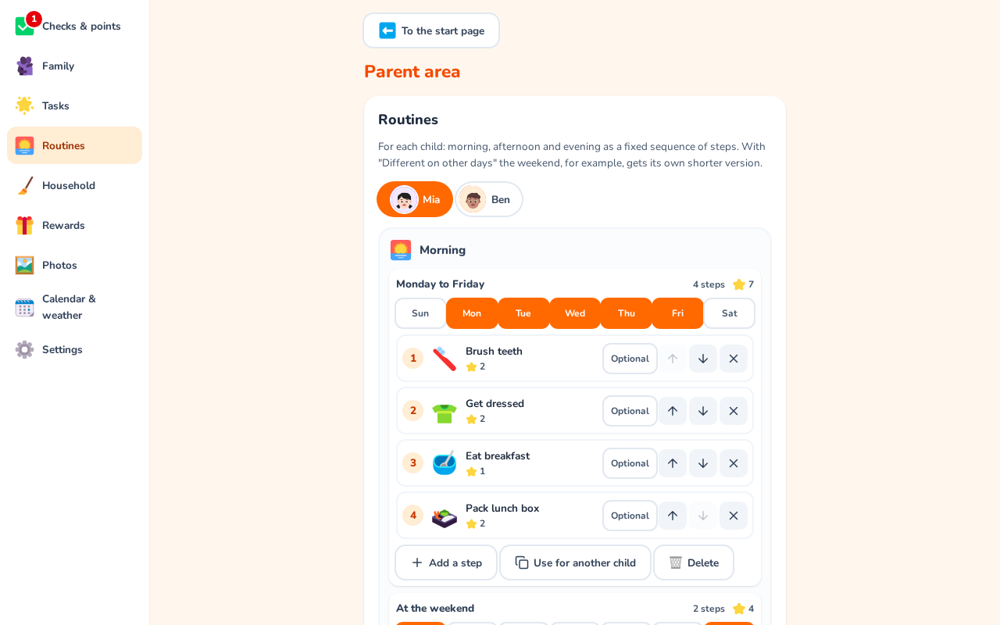

The **"Routines"** section in the parents' area puts together each child's routines: a fixed
sequence of steps for the **morning**, **afternoon** and **evening** (**midday** too, once there is
a routine for it). Tap a child at the top; the chosen child is always highlighted.

- **Versions for different days:** each routine has its weekdays (tap Mon … Sun). With **"Different
  on other days"** a time of day gets another version, e.g. a shorter weekend morning; it starts as
  a copy of the steps, so you only take out what isn't needed. A day always belongs to exactly one
  version; days without any routine are listed below.
- **Steps** are numbered in the order the child sees them on the display, with the number of steps
  and the stars they are worth. **↑/↓** changes the order, **✕** takes a step out of the routine
  (the task itself stays), a tap opens the task editor.
- **Optional steps** (e.g. "pack the teddy") stay in the routine and earn points but don't count
  towards the daily progress; on the display they have a dashed border.
- **"Add a step"** creates a new step (the editor only asks for icon, title, points and so on; the
  routine decides the child, time of day and days) or reuses an existing one, e.g. "brush teeth"
  from the weekday version.
- **"Use for another child"** copies a version to a sibling (same steps; each child completes and
  earns points separately). On those days it replaces the sibling's current routine.

For a child, a task that is a routine step is due exactly on the routine's days; its own "How
often" only applies to other children who have the same task. Extras, "anytime" and
one-off or flexible tasks are not part of a routine; they stay in the "Tasks" section. When
updating, existing children's tasks are turned into routines automatically: weekdays with the same
steps become one version, the order is kept.

## Today (start page)

The start page is a week dashboard for the wall display (stacked on narrow screens):

- **Top:** family name, date, a small **weather** (icon, current temperature, today's high/low, an
  umbrella from 50 % chance of rain) and a large clock. Parents choose the town in the parents' area
  under **Calendar & weather** (search by name or postcode, then pick from the list); without a
  town it says "Set up weather".
- **Children's routine:** only the children, only the current time of day (morning, midday,
  afternoon, evening) with its tasks as icons. **One tap** completes a task, just like in the family
  view (with "+2", hourglass for parent checks); tap again to undo. When everything is done, or no
  routine is due right now, the child just shows **"All done"**. The avatar opens the person view,
  the arrow opens the tasks.
- **Household** next to it: whatever is **red or yellow** in the cleaning plan, most urgent first
  (six at most, the rest as "+3 more"). **One tap** marks a chore done, then the "Who did it?" bar
  appears just like in the Household view; done chores stay crossed out until the end of the day,
  another tap takes it back. If nothing is due it says "All in the green". The arrow opens the
  whole cleaning plan (see [Household](#household)).
- **Shopping** next to it: what's missing, as icons with names (and amount or note). "Add" opens
  the same dialog as the shopping list (see [Shopping list](#shopping-list)); the arrow opens the
  list.
- **The next seven days** from today across the full width: public or school holidays, the events
  in each person's colour (a tap opens the details) and **the meal at the bottom** of each day with
  its photo or icon and name, e.g. "Oven vegetables with sausages". A tap on the meal or the **+**
  plans it right there (see [Meal plan](#meal-plan)). Without a calendar it says "Connect a
  calendar"; the meals still show. On the wall display the page fits the screen: the meals always
  stay visible at the bottom, and on a busy day only that day's events scroll (a fade and a small
  arrow show there's more). All-day events take a single line; events that are already over today
  shrink to time and title.

**Customising the start page:** the gear on "Today" asks for the parents' PIN and then lists the
sections weather, children's routine, shopping, events and meals. Each can be switched on or off;
the arrangement is fixed. Below that you choose how the week runs: **From today** (today always
first, then the next six days) or **Monday to Sunday** like a weekly planner, where the days already
past stay visible but faded. "Restore default" switches everything back on and the week back to
"From today". The setting is stored on
the server and applies to every display of the family. The week overview of tasks (one ring per
person) lives in the tasks area under "Week".

## Family view

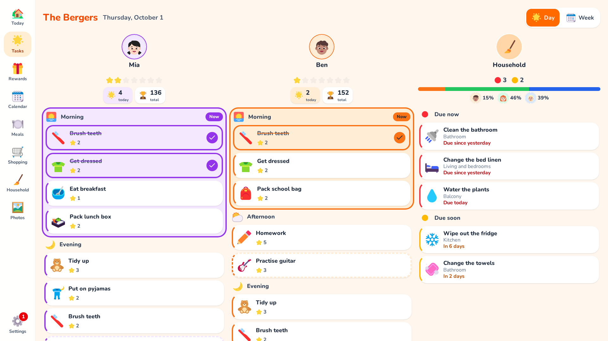

The family view ("Tasks", star icon) shows the children side by side, each with a large avatar and
today's tasks. Nobody has to sign in or switch users: whose task it is follows from the column.
Adults have no column of their own; to the right there is the **Household** column (broom) with
whatever is red or yellow in the cleaning plan right now (see [Household](#household)). It appears
as soon as there is a cleaning plan.

- **One tap** on a task card completes it for that person (tick, card in the person's colour).
  **Tap again** to undo. Each task can be done only once per person and day, even with double
  taps.
- Tasks are grouped by **time of day** as routines in the order set by the parents (sunrise, sun,
  sun behind cloud, moon; plus "Anytime"), followed by the optional **Extras** (flexed biceps). The
  current section is highlighted. A section that is completely done collapses into a single line
  with a tick and can be opened again with a tap. Times of day: morning until 11:00, midday until
  14:00, afternoon until 18:00, evening after that.
- A tap on the **avatar** opens the person view with the same tasks in large. After one minute
  without input the display returns to the start page.
- With many people or a narrow screen, the columns can be swiped sideways. On a phone there is one
  person per page, with an avatar bar at the top to switch.
- The **navigation bar** (left, at the bottom on phones) uses icons for "Today" (house), tasks
  (star, the family view), rewards (gift), calendar and settings (gear, parents' area with PIN). A red number on the gear shows how many
  completed tasks are waiting for a parent check.

**Day | Week:** the switch at the top right of the family view opens the **week view**
(Monday–Sunday, browse with the arrows like the calendar). For each day and person it shows the
tasks as small icons in routine order: done in the person's colour with a tick, waiting for a
parent check with an hourglass, still to do in white, not done on past days faded, "One for all"
done by someone else in grey. Next to each person: how many routine tasks are done (extras don't
count). The week view is for looking only; tasks are completed today, in the day view or on the
start page. Past days show the tasks as they are set up now (from the day they were created) plus
everything that was actually done.

The layout scales with the window height from tablet width upwards: full size at 1080 px (wall
display), proportionally smaller on laptops with display scaling (e.g. a 14" screen), never below
75 %. On phones it stays at full size. Under "This device" in the parents' area you can also pick a
**display size** (small, normal, large) that only applies to that device, e.g. smaller on a tablet
and larger on the wall display. The same section shows what the browser reports (window size,
scaling, base font size), which helps when setting up a new display.

The server always calculates "today" in the family's time zone. The view reloads every minute so
day changes and edits from the parents' area show up.

## Points

Below each avatar, a **row of stars** shows the daily progress (one star per task, done ones light
up; from 9 tasks on, a bar). Next to it are the **points earned today** (star) and the **points
balance** (trophy). When ticking off a task, "+2 ⭐" floats briefly above the card. If reduced
motion is enabled in the system settings, it appears without animation.

Points are never stored as a counter but as **ledger entries**; the balance is their sum.

- Completing books the task's points, undoing books exactly that amount back (reversal), even if
  the task's points have changed since.
- There is at most one completion per task, person and day (database constraint). Only the request
  that actually creates or deletes it books points, so double taps never give double points.
- Ledger entries are never changed or deleted. If a task is deleted, its entries stay with the
  title at the time. Only when a person is deleted do their entries disappear too.
- Tasks worth 0 points create no entry.

In the parents' area, the **"Points"** section shows each person's balance. Tapping a person opens
their **history** (newest first, older ones via "Load older transactions") and a form to **credit or
deduct** points with a reason (1 to 1000). A deduction may not take the balance below 0.

Adults don't collect points and have no tasks of their own; their housework lives in the cleaning
plan (see [Household](#household) and [Fair sharing](#fair-sharing)).

## Parent checks

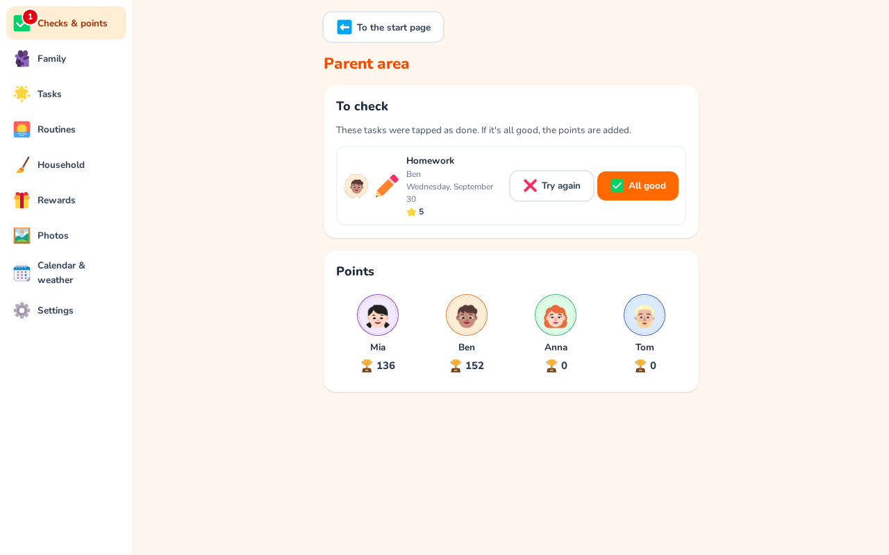

For tasks such as "Tidy your room" you can switch on **"Parents check"** in the editor. The child
taps the card as usual; instead of a tick an **hourglass** appears and no points are given yet.
The gear in the navigation bar shows how many completions are waiting.

In the parents' area (after the PIN), **"To check"** then appears at the top:

- **All good** confirms the completion and books the points, exactly once and for the day it was
  done. Several entries can be confirmed at once with "Confirm all".
- **Try again** rejects it: the completion is removed and the task is open again.

Completions from earlier days stay checkable. If the child undoes the completion before the check,
nothing is booked.

## Rewards

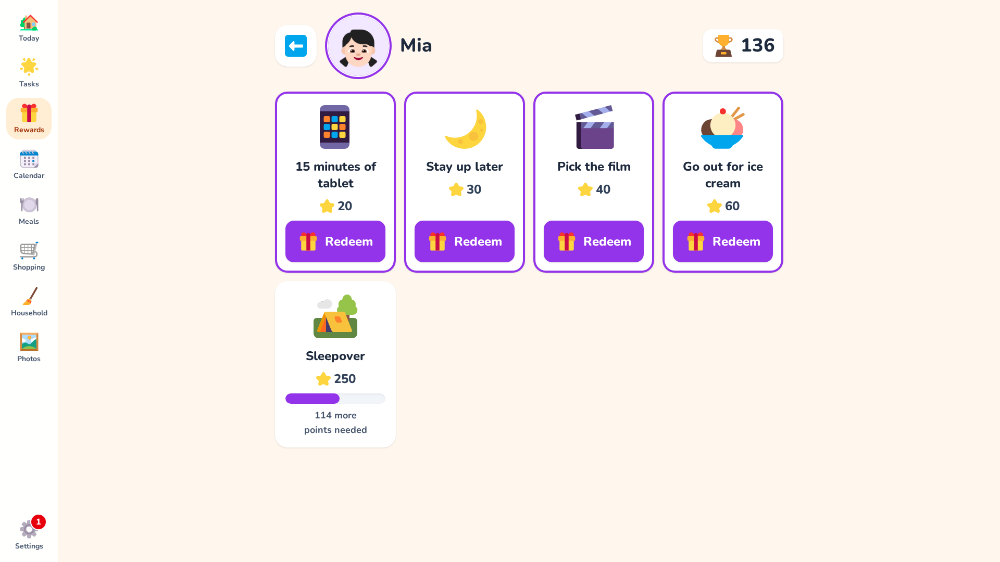

Rewards are **only for children**, and each child has their own, so choice and cost fit their age.
Under "Rewards" in the parents' area you pick a child and then:

- **Choose from suggestions**: a list of about 30 rewards in three sizes (small about 5–20, medium
  20–50, big 50–100 points), e.g. an ice cream, one more bedtime story, staying up 15 minutes
  longer, movie night with popcorn, zoo or theme park. Several can be added at once; ones the child
  already has are marked.
- **Custom reward**: name, icon ("Rewards" category in the catalogue), cost (1 to 1000),
  description.

Cost and name can be changed afterwards. Inactive rewards are hidden on the display. Below the list
you see what the child redeemed recently.

On the display, the **gift** in the navigation bar leads to the list of children, and a tap on an
avatar to their reward cards (a child's person view shows them too):

- With enough points the card shows **"Redeem"**, otherwise **"8 more points needed"** with a
  progress bar.
- After "Redeem", a large card asks for confirmation with ✓ and ✗. Once confirmed, the server
  deducts the cost. It checks balance and cost in one transaction, so the balance can never go
  negative. A short celebration follows.

The redemption stores name, icon and cost, so the history stays correct even if the reward is later
changed or deleted. The suggestions live in `frontend/src/pools/rewards.ts`.

## Fair sharing

Adults get neither points nor rewards. Instead, FamQuest shows how the housework is shared:
**"Who did it?"** counts the chores done in the cleaning plan over the last 30 days for which
someone tapped an avatar in the "Who did it?" bar, and shows the shares (e.g. 40 % and 60 %) as a
split bar in the people's colours. You find it at the bottom of the **Household** view (with names
and counts) and in compact form above the Household column under **Tasks**.

Adults are always listed, children only if they helped. What counts is the number of chores, not
the effort; chores done without naming anyone count for nobody. This is deliberately not a
competition but a way to share the work fairly. As long as nobody has been tapped, or only one
person would be listed, the display is hidden.

## Google Calendar

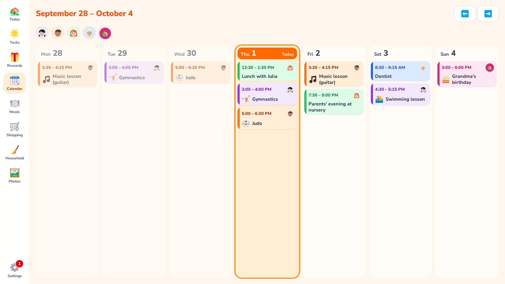

FamQuest shows your Google calendars as a week on the display: one column per day (Monday to
Sunday), events in the colour of the person they belong to, with their avatar. FamQuest only
reads the calendars and never changes them.

**In the parents' area under Calendar:**

- Connect one or more Google accounts (setup below).
- All calendars of the account are listed. Switch on the ones that should appear on the display.
- For each calendar, choose who it **belongs to**: a person or **Family** (for everything that
  concerns everyone, e.g. a shared family calendar, bin collection or holidays).
- **Family colour**: "Family" gets its own colour and a house as its avatar. Pink and grey are
  reserved for the family; colours already used by people are greyed out.
- Each calendar shows when it was last updated, or what went wrong. **Update now** fetches
  immediately.

**On the display:** once at least one calendar is switched on, the navigation bar shows a
calendar symbol. The arrows browse weeks; today is highlighted and events that are over fade out.
Tapping an avatar at the top shows only that person's events (plus family events); tapping again
shows everyone. If the same event is in several calendars (e.g. an invite to both parents), it
appears once with all avatars. All-day events look like the others, with "All day" instead of a
time. Tapping an event shows its details: date and time, people, location, description and the
calendars it comes from. Events are edited in Google Calendar; FamQuest only shows them. If a
calendar can't be updated, a note appears above the week; the last known events stay visible.

**Public and school holidays (Germany):** if the family language is German, the parents' area
under **Calendar** has a **State** (Bundesland) setting with two switches, **public holidays** and
**school holidays**. They appear subtly in grey above each day's events (🎉 public holiday,
🏖️ school holidays) and work without a Google account too. Public holidays are calculated
offline; school holidays are loaded once a day from [OpenHolidays](https://www.openholidaysapi.org)
(only the state is sent, no personal data).

**Symbols for events:** children who can't read yet don't recognise their events by the title.
Under **Calendar & weather → Symbols for events**, choose which words get a symbol: pick from
about 20 suggestions (gymnastics, judo, riding, swimming, football, music lesson, playdate,
birthday, grandparents, daycare, doctor, dentist …) or add your own entries with one symbol and
several words ("Playdate, at Lena's"). A word also matches as part of a longer one ("swim" in
"Swimming lesson"); words of up to three letters only match as a whole word. If several words
match, the longest one wins. Whether a person's
events get symbols is a switch in their profile (**Symbols for events**): on for children, off for
adults by default; switch it off for older children. The symbol appears in the calendar, on
"Today", in the event details and on the picture frame.

## Weather

The start page shows the weather for one town. The forecast comes from
[Open-Meteo](https://open-meteo.com) (free for non-commercial use, no API key). The server makes
the request, not the browser; only the town's coordinates and the time zone are sent. Forecasts
are cached for 15 minutes; if Open-Meteo is unreachable, the last forecast is shown for up to
6 hours with a note. The town search in the parents' area also goes through the server
(Open-Meteo geocoding). Without a town, FamQuest makes no weather requests at all.

**Sync:** every 5 minutes (`CALENDAR_SYNC_MINUTES`) FamQuest asks Google whether anything has
changed (incremental, via sync token). Only then, when the week changes, or every 6 hours as a
safety net are the events reloaded, for a window from 4 weeks before the current week to about
half a year ahead. Recurring events are stored as individual occurrences; all-day and multi-day
events are supported. If Google is unreachable or throttles requests, the next run simply tries
again.

Because FamQuest is self-hosted, every installation needs its own access to Google. This is a
one-time, free setup. FamQuest must be reachable via **HTTPS on a domain** (e.g.
`https://family.example.com` through a reverse proxy). Google doesn't allow redirects to an IP
address or to `http://`, except `http://localhost` for development.

1. In the [Google Cloud Console](https://console.cloud.google.com/), create a new project, e.g.
   "FamQuest".
2. Under **APIs & Services → Library**, enable the **Google Calendar API**.
3. Under **Google Auth Platform**, set up the app: name (e.g. FamQuest) and support email,
   audience **External**. Under **Data access**, add the scope
   `https://www.googleapis.com/auth/calendar.readonly`.

   Home page, privacy policy and terms of service are optional for your own use (only required
   for a review by Google). If you want to fill them in, you can use the project pages:
   `https://craebby.github.io/FamQuest/`,
   `https://craebby.github.io/FamQuest/privacy-policy.html` and
   `https://craebby.github.io/FamQuest/terms-of-service.html` (in German). They describe the
   software; for your own details, adapt the files in `docs/` and publish them yourself.
4. Under **Clients**, create a new OAuth client of type **Web application**. Add this
   **Authorized redirect URI**: `https://family.example.com/api/calendar/google/callback` (with
   your domain). The parents' area shows the exact address under **Calendar → Google setup**.
5. Put the client ID and client secret into `.env`, plus a key that encrypts the tokens:
   ```sh
   GOOGLE_CLIENT_ID=1234….apps.googleusercontent.com
   GOOGLE_CLIENT_SECRET=GOCSPX-…
   TOKEN_ENCRYPTION_KEY=…   # openssl rand -base64 32
   ```
   Then run `docker compose up -d`.
6. **Important:** under **Audience**, **publish** the app ("In production"). In "Testing" status,
   access expires after 7 days and accounts would have to be reconnected every week. A review by
   Google isn't needed for your own use.

When connecting, Google then shows "Google hasn't verified this app". That's normal for a
self-hosted app: choose **Advanced → Go to FamQuest** and tick calendar access. You can connect
several Google accounts, e.g. one per parent.

Back up `TOKEN_ENCRYPTION_KEY` together with `.env`. If it's lost or changed, the parents' area
shows "Reconnect" for every account; nothing else is lost. Disconnecting an account also revokes
access at Google.

## Meal plan

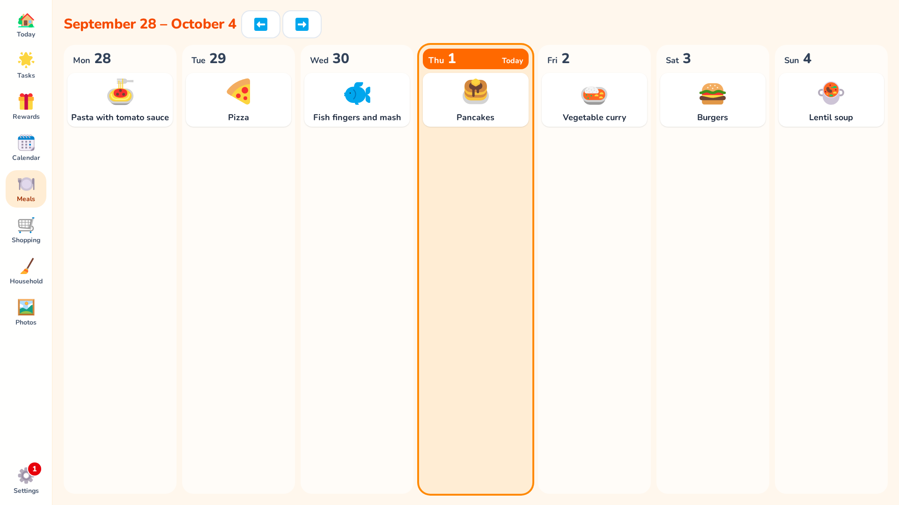

**Meals** (plate with cutlery) in the navigation bar shows the week's meal plan, Monday to Sunday,
with today highlighted. The arrows browse to other weeks.

- **No parents' PIN needed**, right on the display or on a phone: tap a day's **+**, then tap a
  suggested dish or type its name and "Save".
- **Suggestions:** your own dishes first (most recently planned first), then about 50 common ones
  such as pasta with tomato sauce, schnitzel, dumplings or bread and cold cuts. Typing filters them.
- **Icon:** picked automatically from the name (e.g. "Schnitzel with rice" → meat, otherwise a
  plate) and changeable with a tap on it. The icon belongs to the dish and applies wherever it's
  planned.
- FamQuest remembers a typed dish and suggests it again. The same name in different case is the
  same dish.
- Tap a planned dish to change it; "Remove from plan" clears the day again.
- **Editing your own dishes:** the pencil on one of your dishes in the suggestions opens its name,
  icon and **photo**. A photo (straight from the camera on a phone) is cropped square, scaled to
  512 × 512, stored without metadata and then replaces the icon everywhere, including "Today".
  "Delete dish" removes it from the suggestions and from past weeks; if it's planned for today or
  later, remove it from the plan first.

By default only **dinner** is planned. In the parents' area under **Settings → Meal plan** you can
switch on breakfast, lunch and snack (for the whole family); every day then shows each meal with its
icon. Meals you switch off stay stored.

## Shopping list

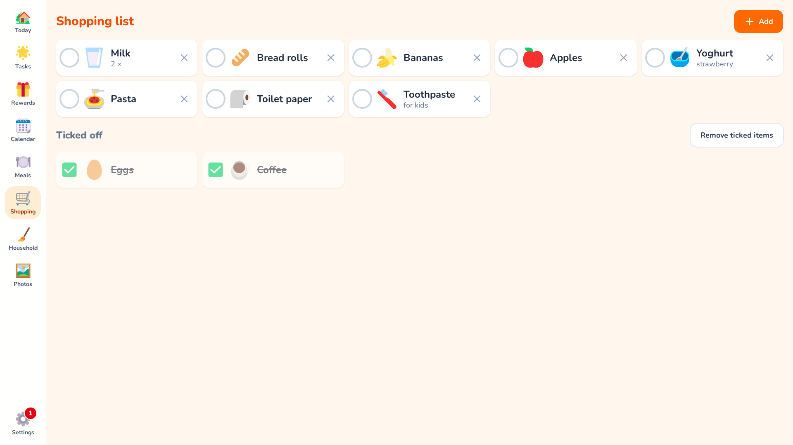

**Shopping** (trolley) in the navigation bar shows what's missing, in large rows with icons.

- **No parents' PIN needed**, on the display or in a phone's browser. **"Add"** opens "What do we
  need?": tap a suggestion or type a name, optionally with an **amount or note** ("2 ×", "lactose
  free"), then "Add". The dialog stays open so you can add several items in a row; "Done" closes
  it.
- **Suggestions:** your own items first (most often bought first), then about 65 common ones such as
  milk, bread rolls, bananas, toilet paper or nappies. Items already on the list are marked with a
  tick; **tap again** to take one off. Typing filters the suggestions.
- **Icon:** picked automatically from the name (e.g. "Red onions" → onion, otherwise shopping bags)
  and changeable with a tap on it. The pencil on one of your items renames it, changes the icon or
  deletes it.
- **Ticking off:** one tap on a row ticks it off, another tap brings it back. Ticked items stay at
  the bottom, crossed out, **until the end of the day** (in the family's time zone), so a wrong tap
  in the shop can still be undone; then they disappear on their own. "Remove ticked items" clears
  them right away; the × takes an item off the list.
- The list reloads every 30 seconds, so the display shows what someone added on their phone.

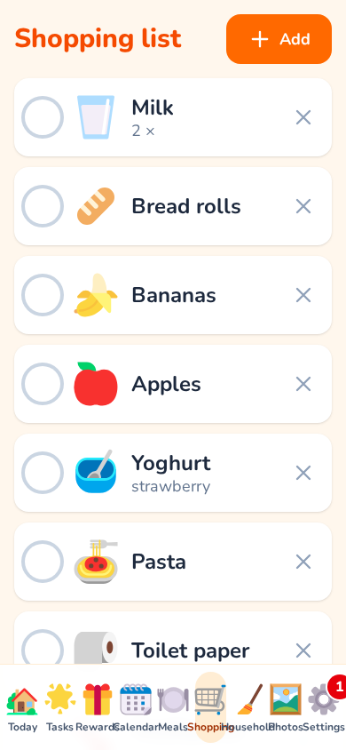

**On the phone:** open FamQuest in the browser. Away from home this needs FamQuest to be reachable
from outside, e.g. over HTTPS behind a reverse proxy (see [Behind a reverse proxy](#behind-a-reverse-proxy))
or via a VPN. An installable app that also works offline in the shop is planned for 1.2.

## Household

**Household** (broom) in the navigation bar holds the cleaning plan: recurring housework without a
fixed date. Every chore has its own interval ("every 2 weeks", "every 3 months"), and a traffic
light shows how urgent it is.

- **Traffic light:** green means "can wait", yellow "due soon" (from 70% of the interval, two weeks
  ahead at most), red "due now". The bar under each row fills up until the chore is due. The clock
  runs **from the last time it was done**, not by the calendar; missed chores don't pile up, a
  chore is simply "due for 5 days".
- **Done:** one tap on the row, **without the parents' PIN**. A bar then briefly asks
  **"Who did it?"**: tap an avatar, choose "Undo", or just do nothing. Chores done today are listed
  faded below; another tap takes it back.
- **Sorting:** "Most urgent first" (Due now, Due soon, Can wait) or "By room".
- Housework belongs to the household, not to one person. Whoever has time does it.
- **Also on "Today" and under "Tasks":** whatever is red or yellow appears as the "Household" tile
  on the start page and as a "Household" column of its own next to the children under **Tasks**,
  each with one tap to mark it done. Green chores only show in this view. Above the column you see
  the traffic light in numbers and the [fair sharing](#fair-sharing) bar.

### Setting up the cleaning plan

In the parents' area under **Household**. The quickest way is **"Start assistant"**:

1. A few questions: flat or house, how many bathrooms, plus switches for garden, balcony or patio,
   robot vacuum, dishwasher, tumble dryer, pets, car, fireplace or stove, kids' room, and paperwork
   and tech. **"How thorough should it be?"** (relaxed, normal, thorough) makes all intervals
   longer or shorter.
2. The suggestion shows rooms with chores and intervals. Only the essentials are ticked (roughly 10
   to 20 chores, depending on your home), so the plan stays manageable at the start. Tap what you
   want on top, untick what doesn't fit, then "Add chores".

Each room is cleaned in one go ("Clean the bathroom", "Deep-clean the kitchen"); separate chores
only exist for what is due less often, such as "Clean the drains" or "Clean the oven".

Two bathrooms in a house are called "Upstairs bathroom" and "Downstairs bathroom" and have separate
chores, so you can clean the rarely used one less often; a third counts as a guest toilet. With a
robot vacuum the assistant suggests emptying and cleaning the robot and "Vacuum corners, stairs and
under furniture" instead of "Vacuum". So that not everything is due on the same day, it spreads the
start across the intervals. You can run it again later: what is already there stays untouched.

Everything can be changed by hand afterwards:

- **Add / edit room:** name and icon are up to you. Deleting a room deletes its chores too.
- **Add / edit chore:** title, icon, room and **"How often?"** as a number with days, weeks, months
  or years. For new chores you pick the current state: just done, halfway or due now. A changed
  interval counts from the last time the chore was done.
- **Pause:** the switch next to a chore hides it on the display without deleting it (e.g. "Mow the
  lawn" in winter).

The templates live in `frontend/src/pools/chores.ts`, their names in
`frontend/src/locales/<language>/pool.json`.

The cleaning plan has replaced the former adults' tasks: tasks now exist for children only. **When
updating**, tasks assigned exclusively to adults are deleted (with their completions); tasks for
both children and adults only lose the adults' assignment. Point entries are kept. Make a
[backup](#backup-and-restore) first if you want to look up the old tasks later. A child can only be
turned into an adult once it has no tasks and routines left.

## Photos (picture frame)

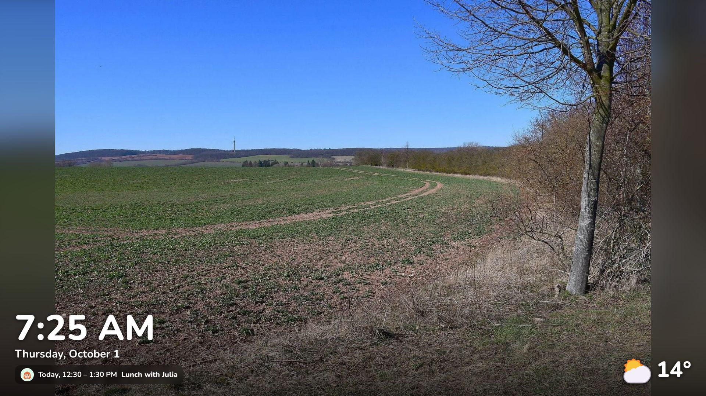

Upload the photos for the picture frame in the parents' area under **Photos** (framed picture
icon).

- **Add photos** picks several photos at once, on a phone straight from the gallery. They are
  uploaded one after another with a progress bar. If a photo fails, it is listed with the reason;
  the others still arrive.
- JPEG, PNG and WebP up to 25 MB are supported. iPhones usually convert HEIC photos to JPEG
  themselves when uploading.
- The server checks every photo, turns it the right way up, scales it down to at most 2560 pixels
  on the long edge and re-encodes it as WebP. Location (GPS) and other metadata are removed; only
  the capture date is kept and shown below the photo.
- **Show** hides a photo or shows it again without deleting it. **Delete** (wastebasket) asks first.

Photos are stored in the `uploads` volume (subfolder `photos`), can only be fetched when signed in
and are included in the [backup](#backup-and-restore).

**The picture frame on the display**

- As soon as at least one photo is shown, a **Photos** icon (framed picture) appears in the
  navigation bar. It starts the picture frame.
- The photos appear full screen in random order with a soft cross-fade, by default one per minute.
  Every photo is shown once before any photo comes again.
- Photos that roughly match the screen fill it. Portrait photos and very different shapes are shown
  in full, with a blurred copy of the same photo behind them instead of black bars.
- A tap anywhere ends the picture frame and goes to "Today". That tap doesn't tick off anything.
- **Start when idle** is set per device under **Settings → This device → Picture frame when
  idle** (off, 1, 5, 10 or 30 minutes; off by default). Switch it on for the kitchen display and
  leave it off on parents' phones. It only starts from the everyday views, not in the parents'
  area.

**Overlays and duration**

In the parents' area under **Photos**, the **Picture frame** card sets what appears at the bottom of
the photos. These settings apply to the whole family and take effect straight away.

- **Clock and date** (bottom left, large), **Weather** (bottom right, symbol and temperature) and
  **Next event** (below the clock, with the avatar of the person it belongs to) are on by default.
- **Open tasks** is off by default. When switched on, each person with tasks still open today shows
  up with their avatar and the symbols of those tasks (up to four, then "+n"), so children can see
  at a glance what is left. Extras and optional routine steps don't count. The overlays can't be
  tapped: a tap still just goes back to "Today".
- **Show each photo for**: 15 or 30 seconds, 1, 2 or 5 minutes (default 1 minute, calm rather than
  hectic).
- Weather and events only appear once a place or a calendar is set up.

**Night mode**

On the same card, **Night mode** keeps photos off the display at night. It is off by default.

- **From** and **Until** set the time window in the family's time zone; it may run past midnight
  (default 22:00 to 06:00). If both times are the same, night mode never kicks in.
- **Black**: the screen stays completely dark. **Dimmed clock**: a large, dark grey clock on black.
  It moves a little every 5 minutes so it doesn't burn in.
- At night there are no overlays and no photos are loaded. In the morning the photos continue on
  their own.
- A tap still goes to "Today". On devices with **start when idle**, the night screen comes back
  after the idle time; on devices without it, it only appears when the picture frame is started.

A browser can't switch off the display's backlight: "black" still glows faintly. To really switch
the display off, use a command on the computer driving the display, for example via cron:

```cron
# Wayland (e.g. current Raspberry Pi OS): off at 22:00, on at 06:00
0 22 * * * WAYLAND_DISPLAY=wayland-1 XDG_RUNTIME_DIR=/run/user/1000 wlr-randr --output HDMI-A-1 --off
0 6  * * * WAYLAND_DISPLAY=wayland-1 XDG_RUNTIME_DIR=/run/user/1000 wlr-randr --output HDMI-A-1 --on

# X11
0 22 * * * DISPLAY=:0 xset dpms force off
0 6  * * * DISPLAY=:0 xset dpms force on
```

Which command works depends on the device and the desktop; `wlr-randr` without arguments lists the
output names. On older Raspberry Pi OS without the KMS driver, `vcgencmd display_power 0`/`1` also
works.

## Configuration

Configuration is done exclusively through environment variables in `.env`. All variables are
described in [`.env.example`](.env.example).

| Variable | Default | Meaning |
| --- | --- | --- |
| `POSTGRES_USER` | `famquest` | Database user |
| `POSTGRES_PASSWORD` | – (required) | Database password |
| `POSTGRES_DB` | `famquest` | Database name |
| `APP_PORT` | `8080` | Port on the host |
| `LOG_LEVEL` | `info` | `critical`, `error`, `warning`, `info`, `debug` (for troubleshooting) |
| `FORWARDED_ALLOW_IPS` | `127.0.0.1` | Trusted reverse proxies |
| `PROXY_NETWORK` | `proxy` | Docker network of your reverse proxy (see below) |
| `GOOGLE_CLIENT_ID` | – | OAuth client for [Google Calendar](#google-calendar) |
| `GOOGLE_CLIENT_SECRET` | – | Its client secret |
| `TOKEN_ENCRYPTION_KEY` | – | Encrypts the Google tokens in the database |
| `PUBLIC_URL` | – | Public address, e.g. `https://family.example.com`; fixes the Google redirect URI behind a reverse proxy |
| `CALENDAR_SYNC_MINUTES` | `5` | Minutes between calendar syncs in the background; `0` = off |

Data lives in two Docker volumes: `db-data` (PostgreSQL) and `uploads` (uploaded images). How to
back them up is described under [Backup and restore](#backup-and-restore).

## Backup and restore

Back up the **database** and the **uploaded images**. Both work while the app is running, from the
project folder (where `docker-compose.yml` is):

```sh
mkdir -p backup
# Database (PostgreSQL dump in custom format)
docker compose exec -T db sh -c 'pg_dump -U "$POSTGRES_USER" -d "$POSTGRES_DB" --format=custom' \
  > backup/famquest-$(date +%F).dump
# Images
docker compose exec -T app tar czf - -C /data uploads > backup/uploads-$(date +%F).tar.gz
```

Also store the files somewhere off the machine (NAS, external drive). `.env` belongs in the backup
too, but it is not part of the repository.

**Restore**, e.g. on a new machine after `git clone` and `cp .env.example .env` (with the same
`POSTGRES_*` values):

```sh
docker compose up -d db
# Restore the database (existing tables are replaced)
docker compose exec -T db sh -c \
  'pg_restore -U "$POSTGRES_USER" -d "$POSTGRES_DB" --clean --if-exists --no-owner' \
  < backup/famquest-2026-10-03.dump
# Restore the images
docker compose run --rm -T --no-deps --entrypoint tar app xzf - -C /data \
  < backup/uploads-2026-10-03.tar.gz
docker compose up -d
```

On start, the app migrates the database to the latest version. A backup of an older version can
therefore be restored into a newer one, but not the other way round.

`scripts/backup.sh [TARGET_DIR] [DAYS]` does both in one go (default: `backup/`, backups older than
30 days are deleted). For a nightly backup via cron:

```
0 3 * * * /path/to/famquest/scripts/backup.sh /mnt/nas/famquest 30
```

The cron user needs access to Docker (group `docker`).

## Behind a reverse proxy

### Proxy as a container in a Docker network (e.g. Nginx Proxy Manager)

If your proxy runs as a container in its own Docker network (for example called `proxy`), add
these two lines to `.env`:

```sh
COMPOSE_FILE=docker-compose.yml:docker-compose.proxy.yml
PROXY_NETWORK=proxy
```

Then run `docker compose up -d`. The app joins that network and is reachable there as
**`famquest`, port `8000`**. No port is published on the host any more, and `FORWARDED_ALLOW_IPS`
defaults to `*` (only the proxy can reach the app). In Nginx Proxy Manager: new proxy host, scheme
`http`, forward hostname `famquest`, forward port `8000`, plus an SSL certificate. This needs
Docker Compose 2.24 or newer.

### Proxy on the host or another machine

The app evaluates `X-Forwarded-For` and `X-Forwarded-Proto`, but only from the addresses in
`FORWARDED_ALLOW_IPS`. This matters: only if the app knows it is served over HTTPS does the session
cookie get the `Secure` flag.

Recommended setup when the proxy runs on the same host:

```sh
# .env
APP_PORT=127.0.0.1:8080       # app only reachable for the local proxy
FORWARDED_ALLOW_IPS=*         # acceptable because nobody else can reach it directly
```

If the proxy runs on another machine, put its IP address into `FORWARDED_ALLOW_IPS`. Note: because
of Docker's port mapping, the app sees the address of the Docker network (e.g. `172.18.0.1`) as the
sender, not `127.0.0.1`. The default `127.0.0.1` therefore only applies without a proxy.

The proxy must pass on the original `Host` header (Caddy and Traefik do this automatically; for
nginx use `proxy_set_header Host $host;`). Setup and sign-in use it to check that requests come from
the app's own page.

Photos for the picture frame may be up to 25 MB. nginx only allows 1 MB per request by default, so
set `client_max_body_size 30m;` there (in Nginx Proxy Manager under "Advanced").

The app must run on its own (sub)domain, e.g. `family.example.com`. A sub-path such as
`example.com/family` is not supported.

## Public demo

FamQuest can run as a public demo so people can try it without installing it: a German and an
English instance with the sample family from [`backend/app/demo.py`](backend/app/demo.py), each
with its own database and separate from your real installation.

```sh
docker compose -f docker-compose.demo.yml up -d --build
```

The instances listen on `127.0.0.1:8081` (German) and `127.0.0.1:8082` (English) for a reverse
proxy on the host (change with `DEMO_PORT_DE` and `DEMO_PORT_EN`). If your proxy runs in a Docker
network, add `-f docker-compose.demo.proxy.yml`; the instances are then reachable there as
`famquest-demo-de:8000` and `famquest-demo-en:8000` (network from `PROXY_NETWORK`). Give each one
its own subdomain, e.g. `demo-de.example.com` and `demo-en.example.com`.

What the demo mode (`DEMO_MODE=de` or `en`) does:

- It creates the sample family on start and resets it on the hour (`DEMO_RESET_MINUTES`, default
  60). Events, meals and history are relative to today, the clock and the weather (Berlin) are
  real. During the few seconds of a reset the app answers "The demo is being reset right now".
- The sign-in page shows the parent PIN and a button "Open the demo", no password needed.
- Actions that would spoil the demo for others are blocked: changing or switching off the PIN,
  family settings (name, language, time zone), uploading pictures (avatars, photos, dishes) and
  connecting Google Calendar. Everything else can be tried out.

## Troubleshooting

**Sign-in fails although the password should be right.** The app logs why a sign-in was rejected
(`docker compose logs app`), e.g. `Anmeldung fehlgeschlagen: falsches Passwort für Konto 1` (wrong
password) or `kein Konto mit dieser E-Mail` (no account with this e-mail). With `LOG_LEVEL=debug` in
`.env` (then `docker compose up -d`) it also logs the e-mail address that was entered. Passwords and
PINs are never logged. If a reverse proxy doesn't pass on the `Host` header, the log says so too.

**Google shows `redirect_uri_mismatch` when connecting.** The address FamQuest sends to Google
must match the **Authorized redirect URI** in the Google Cloud Console exactly (scheme, domain,
path). The parents' area shows it under **Calendar → Google setup**, and the log has it too
(`Weiterleitungs-URI: …`). Behind a reverse proxy it often starts with `http://` instead of
`https://` because the app doesn't trust the proxy's headers (`FORWARDED_ALLOW_IPS`, see
[Behind a reverse proxy](#behind-a-reverse-proxy)). The simplest fix: set `PUBLIC_URL` in `.env`,
e.g. `PUBLIC_URL=https://family.example.com`, then `docker compose up -d`.

**Forgot the password.** There is no e-mail reset on purpose; reset it on the server instead:

```sh
docker compose exec app python -m app.cli users                             # list accounts
docker compose exec -it app python -m app.cli reset-password mama@example.org
```

After 5 failed attempts, sign-in is blocked for 15 minutes; restarting the app
(`docker compose restart app`) lifts the block right away.

## Languages

German is the default language. Without a saved choice, the app follows the browser language; the
family language set in the parents' area applies on every device where nobody has picked a
language.

Translations live in `frontend/src/locales/<language>/<area>.json` (`common.json` for the
interface, `icons.json` for icon search terms, `pool.json` for task and reward suggestions). To add
a new language:

1. Copy the folder `frontend/src/locales/en`, e.g. to `frontend/src/locales/fr`
2. Translate all texts
3. Add the language code to `SUPPORTED_LANGUAGES` in `frontend/src/i18n.ts`

A test (`npm test`) checks that every language has exactly the same keys and no empty texts. The
API returns errors as codes (e.g. `common.not_found`), which the frontend translates under
`errors.*`.

## Development

For local development, backend and frontend run directly on your machine; only PostgreSQL runs in
Docker. Requirements: [uv](https://docs.astral.sh/uv/), Node.js ≥ 24, Docker.

Once:

```sh
cp .env.example .env
# In .env: set POSTGRES_PASSWORD and uncomment the COMPOSE_FILE and DB_PORT lines
cd backend && uv sync && cd ..
cd frontend && npm install && cd ..
```

Run (three terminals):

```sh
docker compose up -d db                              # PostgreSQL on 127.0.0.1:5432
cd backend && uv run alembic upgrade head && uv run uvicorn app.main:app --reload
cd frontend && npm run dev                           # http://localhost:5173
```

Vite forwards `/api` to the backend on port 8000. The API documentation is at
`http://localhost:8000/api/docs`.

Tests and lint:

```sh
cd backend && uv run pytest                          # needs the running database
cd backend && uv run ruff check . && uv run ruff format --check .
cd frontend && npm test && npm run lint && npm run typecheck
cd frontend && npm run format                        # formatting (Prettier)
docker compose --profile test run --rm --build tests # backend tests in the container
```

End-to-end tests (Playwright, Chromium):

```sh
cd frontend && npx playwright install chromium       # once
cd frontend && npm run e2e                           # needs the running database
```

`npm run e2e` builds the frontend, creates a fresh database `<POSTGRES_DB>_e2e` and starts the app
on port 8001. The tests cover the main flows in the browser: setup, adding a child and tasks,
ticking off and undoing, the person view on a phone, points, rewards, parent checks and flexible
tasks.

The backend tests create their own database `<POSTGRES_DB>_test` and reset it on every run.

Screenshots and demo data:

```sh
cd frontend && npm run screenshots                   # needs the running database
```

`npm run screenshots` builds the frontend and starts the app twice (German and English), each with
a fresh database `<POSTGRES_DB>_demo_<lang>` and a sample family from
[`backend/app/demo.py`](backend/app/demo.py): four people with emoji avatars, routines, a week of
ticked-off tasks, rewards, a meal plan, a shopping list, calendar events and a few public-domain photos
([sources](backend/demo/photos/CREDITS.md)). The app's clock is set to Thursday of the current week
at 7:25 and the weather is fixed, so the pictures look the same every time. The screenshots end
up in `docs/screenshots/<lang>/`. The demo data can also be loaded on its own into an empty
database: `cd backend && uv run python -m app.demo seed --lang en` (sign in with
`demo@famquest.example` / `famquest-demo`, PIN `1234`).

Migrations:

```sh
cd backend
uv run alembic revision --autogenerate -m "description"    # new migration from the models
uv run alembic upgrade head                                 # apply
```

A test fails if models were changed without creating a migration.

## Architecture

```
Browser ──► reverse proxy (optional) ──► app (FastAPI, port 8000) ──► db (PostgreSQL 16)
                                           ├─ /api/*   JSON API
                                           ├─ /*       built React frontend
                                           ├─ /data/uploads (volume)
                                           ├─ calendar sync in the background ──► Google Calendar API
                                           └─ weather on request (cached) ──► Open-Meteo
```

| Folder | Contents |
| --- | --- |
| `backend/` | FastAPI, SQLAlchemy 2, Alembic, pytest; packages with uv |
| `frontend/` | React, Vite, TypeScript, Tailwind CSS, react-i18next, TanStack Query, Vitest, Playwright |
| `docs/` | Specification, display test checklist, project pages (GitHub Pages from `main` → `/docs`) |
| `scripts/` | Backup script |

The `Dockerfile` first builds the frontend and then copies it into the Python image. The result is
a single app image that runs as an unprivileged user.

## Roadmap

Current state: **1.0** ([releases](https://github.com/craebby/FamQuest/releases)). Versions after
1.0 are a first plan and may still change.

**1.0: released.** Everything listed under [Features](#features), i.e. phases 1 to 6 below. Their
remaining polish comes as 1.0.x updates from everyday use.

**Task system (phase 1):** done; whatever the display test ([checklist](docs/DISPLAY-TEST.md))
doesn't cover is being tried in everyday use.

- [x] 1. Foundation: backend, frontend with i18n, Docker, Alembic, health checks
- [x] 2. First-run setup, sign-in/out, registration lock, parents' PIN
- [x] 3. Family members with colour and photo
- [x] 4. Tasks and routines in the parents' area
- [x] 5. Family view
- [x] 6. Points and daily progress
- [x] 7. Rewards, task templates, parent checks, fair sharing
- [x] 8. Polish: flexible tasks and "One for all", backup/restore, family settings, sign-in
  hardening, display test fixes (compact layout, order of people, display size per device).
  Everything else has to prove itself in practice first.

**Google Calendar (phase 2):** done.

- [x] 1. Connect a Google account (OAuth, encrypted tokens, refreshed automatically)
- [x] 2. Choose calendars and link them to people or "Family" (with its own colour)
- [x] 3. Background sync (incremental), recurring and all-day events, error handling
- [x] 4. Calendar view: week with events in the person's colour and avatars
- [x] 5. Polish: event details on tap, all-day events in the same style, public and school
  holidays per German state, `PUBLIC_URL` for the Google redirect URI
- [x] 6. Added later: symbols for events (words in the title → symbol, suggestions, switch per
  person) so children recognise their events without reading

**In progress: "Today" dashboard (phase 3)**

- [x] 1. Tasks get their own area: the family view moves to "Tasks" (star), "Today" gets the house
- [x] 2. Weather: choose the town in the parents' area, forecast from Open-Meteo
- [x] 3. Start page "Today": clock, weather, the next 5 events, everyone's tasks as tappable icons,
  space for meals and shopping
- [x] 4. Week view in the tasks area (what's coming up, what's done); routines in a fixed order per
  person and optional extra tasks
- [x] 5. Configurable start page: gear on "Today" (with the parents' PIN) to switch tiles on and
  off and change their order, for the whole family; week widget as an optional tile
- [x] 6. Routine management: a "Routines" section in the parents' area showing each child's
  morning, afternoon and evening as blocks in a fixed order; later merged into the "Tasks" section
- [x] 7. Parents' area with a menu: seven areas, sidebar on tablets, bottom bar with "More" on
  phones
- [x] 8. Routines as their own blocks: per child, time of day and weekdays (e.g. a lighter
  weekend evening), numbered and optional steps, copy to another child
- [ ] 9. Polish on the real display; everyday task templates and reward suggestions (done); the
  week widget on the start page was replaced by the week dashboard (phase 5, stage 3)

**Picture frame (phase 4)**

When idle, the display turns into a digital picture frame.

- [x] 1. Manage photos: upload several photos at once in the parents' area (from the gallery on a
  phone), stored scaled down and without metadata, hide and show, delete
- [x] 2. Picture frame: full screen with cross-fades, random order without repeats, portrait
  photos on a blurred background; started from an icon in the navigation bar or after being idle
  (set per device), one tap goes back to "Today"
- [x] 3. Overlays: clock and date, weather, next event, open tasks, each on or off; how long each
  photo is shown (for the whole family)
- [x] 4. Night mode: time window, dark screen or dimmed clock
- [ ] 5. Polish on the real display

**Screenshots:** done. Screenshots of the display, the parents' area and the phone in this README,
generated with demo data (`npm run screenshots`).

**Demo version:** done. A German and an English public instance with the sample family that
resets itself on the hour (see [Public demo](#public-demo)).

**1.1: make it your own**

- Editable templates: families can change, add and remove task templates and reward suggestions
  (stored in the database instead of the code); reworked example templates
- Age-based suggestions: task templates and reward suggestions that fit each child's age (e.g. a
  birth year per child; with several children, suggestions per child)
- Teen style: a less childlike look per person for older children
- Icon picker: "Popular" based on what the family actually uses; popular icons also shown in their
  category
- More than seven people (more colours)
- About page: author, licence, version and a check for updates

**1.2: on the go**

- Installable web app (PWA) for parents' phones: check tasks, book points and add tasks from
  anywhere; the shopping list also offline in the shop, synced once there's a connection again
- Adults can quickly add tasks right from the family view, without the parents' area

**Next: meal planning (phase 5)**

Plan the week's meals right on the display.

- [x] 1. Weekly plan: a "Meals" icon in the navigation bar, browse weeks, type the dish for each day
  (suggestions from earlier dishes and about 40 common ones, icon picked automatically and
  changeable); only dinner by default, breakfast, lunch and snack can be switched on in the
  settings; the "Meals" tile on "Today" shows today's food
- [x] 2. Manage dishes: rename, change the icon, upload a photo, delete (via the pencil in the meal
  plan, no PIN)
- [x] 3. "Today" as a week dashboard: clock and a small weather at the top, below the children's
  current routine and room for shopping, at the bottom the next 7 days across the full width with
  events and meals; sections can be switched on and off with the gear; adults' tasks only under
  "Tasks"
- [ ] 4. Polish on the real display

**In progress: shopping list (phase 6)**

- [x] 1. Shopping list on the display and in the browser: a "Shopping" icon in the navigation bar,
  add items with suggestions and icons (amount or note optional), tick them off, ticked items stay
  until the end of the day; the "Shopping" tile on "Today" shows what's missing
- [ ] 2. Polish in everyday use

**In progress: household (phase 7)**

Nobody ticked off the adults' tasks in everyday life. A cleaning plan with a traffic light replaces
them; the children's routines stay.

- [x] 1. Cleaning plan: rooms, chores with their own interval, a "Household" view with a traffic
  light, one tap marks a chore done, optional "Who did it?"; management in the parents' area
- [x] 2. Setup assistant: questions about your home turn into a suggestion for rooms, chores and
  intervals
- [ ] 3. "To do": a shared list for one-off things without a person or date (e.g. "buy chicken
  feed"); whoever does it ticks it off
- [x] 4. "Household" tile on "Today" (only red and yellow, one tap marks it done); under "Tasks" a
  "Household" column replaces the adults' columns, fair sharing is fed by the cleaning plan (done
  ahead of step 3)
- [ ] 5. Polish in everyday use

**Ideas without a version yet**

- Create and edit events from FamQuest (needs write access to Google Calendar instead of read-only)
- More calendars: iCal/ICS links and other providers (e.g. iCloud, Outlook, Nextcloud)
- Picture frame: photos from Immich (or Nextcloud) instead of uploads only, albums
- Holiday mode: pause routines for a while (e.g. on holiday) or switch to a slimmed-down version
- Recipes for the meal plan, e.g. by connecting [Mealie](https://mealie.io)
- Shopping list: several lists (e.g. supermarket and chemist), sorting by category or aisle (maybe
  with AI help), ingredients from the meal plan, export to Obsidian (Markdown checklist)
- Children's meal wishes: tap your avatar and a dish on the display; parents add it to the plan
  or decline
- Household: seasonal chores (e.g. mowing the lawn only from April to October), changing the order
  of rooms, personal to-dos per person

- Symbols or fixed colours for weekdays (e.g. Monday always green, as in many nurseries) so children
  who can't read yet find their way around the week
- Several families on one installation: e.g. the first admin (or a hidden function) creates
  befriended families and grants access to them. Today FamQuest deliberately serves exactly one
  family per installation.

## License

Copyright © 2026 Craebby

FamQuest is free software: you can redistribute it and/or modify it under the terms of the
[GNU Affero General Public License](LICENSE) as published by the Free Software Foundation, either
version 3 of the License, or (at your option) any later version. In short: you may use, change and
share it freely, also commercially; if you distribute a modified version or run one for others over
a network, you must publish its source code under the same licence.

FamQuest is distributed in the hope that it will be useful, but WITHOUT ANY WARRANTY; see the
licence for details. The bundled [Fluent Emoji](https://github.com/microsoft/fluentui-emoji) icons
are © Microsoft, MIT licence.
